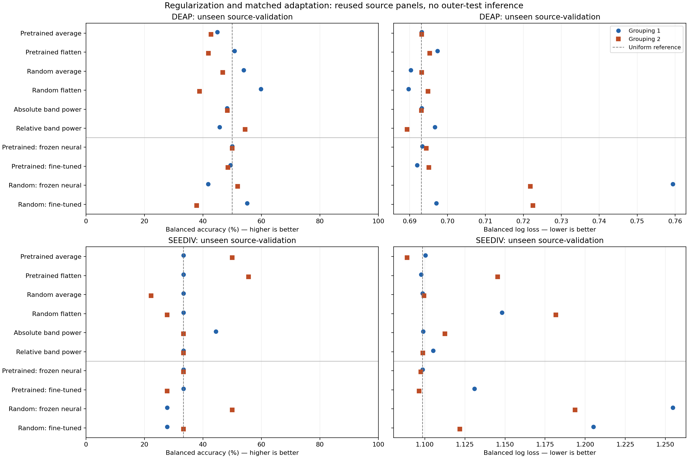
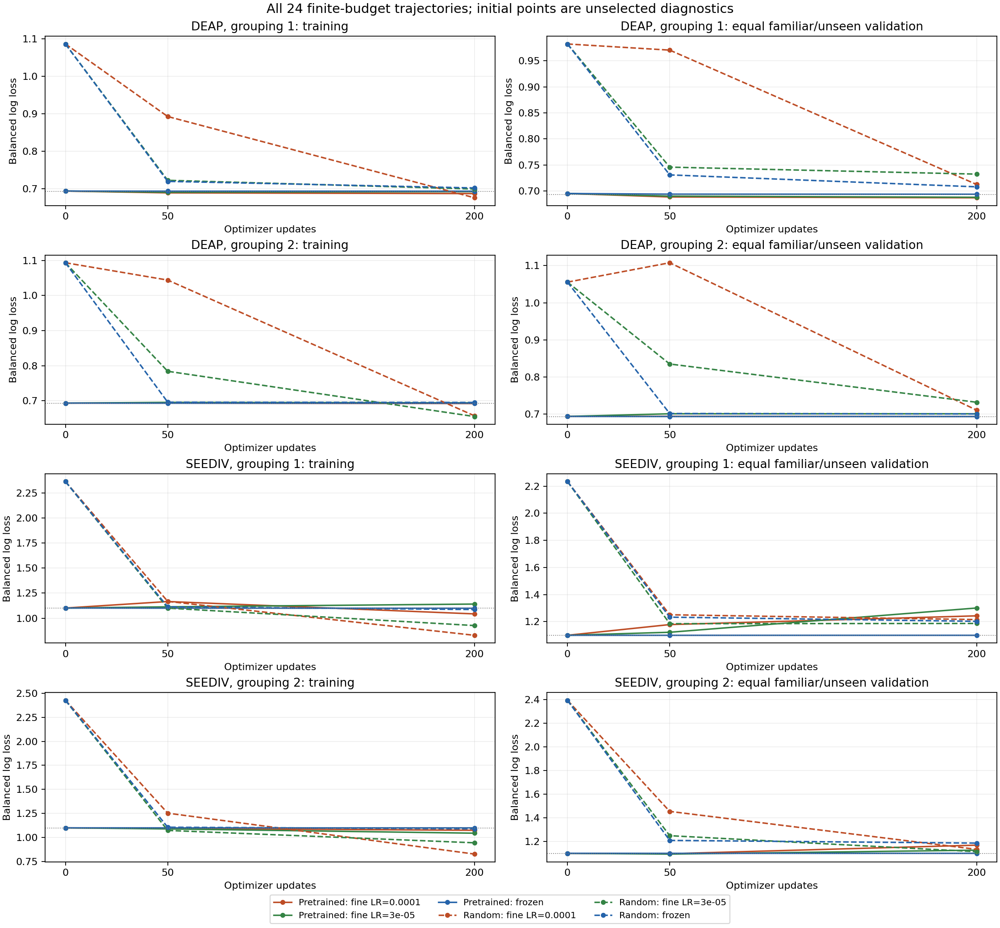

# Stronger regularization and small matched CBraMod adaptation

Completed 9 October 2026. **Stronger regularization reduces the earlier flattened-head overconfidence, but does not establish reliable recognition. Small matched fine-tuning gives no consistent pretrained gain.** The short neural runs leave training capacity/convergence unresolved. This phase is complete; the paper remains unready, and the manuscript and research question are unchanged.

## Completed authorized scope

The [protocol](CBraMod_Adaptation_Protocol_2026-10-09.md) and implementation were pushed in commit `7e834b55f` before fitting. The plan SHA256 is `c1aeae38be5eb5bc4f6b985b7a7478b40f481b52dd01c0f4f3c6ff426f37ef52`. All 44 bound implementation/test/audit files remain unchanged. Verified regularization, eight/sixteen neural trajectories and completion were pushed separately; completed fitting is in `b50fecab0`.

Reuse the earlier source-only DEAP/SEED-IV panels, both participant/video groupings, session 1/rotation 0/fold 0, unexposed arm. Original observations and validation participants/materials stay separated as declared; each grouping excludes its own outer-test people/materials. These groupings reuse the same underlying development cohorts and are not independent new populations. No outer-test inference is made. Labels remain corrected individual binary DEAP valence and SEED-IV's existing assigned coarse three-class task. Neither native four-emotion SEED-IV supervision nor GAMEEMO is assessed here.

Inputs preserve the [previous assessment](GRU-XNet_CBraMod_Assessment_2026-10-09.md): native 32/62 channels, available 200 Hz representations, forty stimulus seconds, four disjoint ten-second windows and numerical amplitude division by 100. The earlier preprocessing adaptations, physical calibration and first-party/checkpoint authentication limitations remain. No outcome-driven trial exclusion, amplitude rescaling, baseline adjustment or label change occurs.

For all six frozen representations and four panels, balanced logistic regression extends C to `1e-6, 1e-5, 1e-4, 1e-3, 0.01, 0.1, 1, 10`. This completes **96 new fits, 96 independent refits and 96 byte-exact older candidates**, with all 24 expanded selections retained. Each source-only StandardScaler is reconstructed independently.

The neural comparison uses the pinned official CBraMod backbone with average-token pooling and one linear 200-to-class head. Pretrained/random42 × frozen/trainable conditions share exact head initializations, balanced observation/window streams and encoder training-mode dropout. Exactly 200 AdamW updates use six trial draws, head LR `0.001*sqrt(6/256)`, fine-tuned encoder LR `1e-4/3e-5`, cosine decay, clipping and label smoothing. At inference, average four window logits before softmax. The [author trainer](https://github.com/wjq-learning/CBraMod/blob/b9e961003214326972c567eff390e75b0287e32a/finetune_trainer.py) motivates the optimizer recipe; this is a locally adapted finite-budget trial task, not a reproduction of author epoch budgets or published scores. Frozen heads have two candidates; fine-tuned conditions have four, including both rates.

All **24 neural trajectories, 48 checkpoints and 16 source-selected neural conditions** complete. Every candidate survives in the record; initial points are diagnostics, never candidates. Equal familiar/unseen validation balanced log loss selects each case, then mean balanced accuracy and stable declared order. This does not choose a global winning model, rate, grouping or new research question.

## Every selected outcome

Every slash below separates grouping 1 / grouping 2. Balanced accuracy is a percentage; lower balanced log loss is better. The uniform references are 50% / ln(2)=0.6931 for DEAP and 33.33% / ln(3)=1.0986 for SEED-IV. Scores use original trials rather than windows and participate in source hyperparameter selection. No population interval or untouched-test interpretation is attached to these tiny reused panels.

### DEAP

| Model | Selected setting, groups 1 / 2 | Train BA (%) | Familiar BA (%) | Unseen BA (%) | Familiar loss | Unseen loss |
| --- | --- | ---: | ---: | ---: | ---: | ---: |
| Pretrained average, logistic | C=1e-06 / 1e-06 | 56.81 / 55.87 | 52.27 / 53.17 | 44.90 / 42.71 | 0.6931 / 0.6931 | 0.6932 / 0.6932 |
| Pretrained flatten, logistic | C=1e-06 / 1e-06 | 75.63 / 71.37 | 46.97 / 52.65 | 50.78 / 41.90 | 0.6956 / 0.6925 | 0.6973 / 0.6953 |
| Random average, logistic | C=0.0001 / 1e-06 | 53.37 / 54.52 | 60.61 / 51.61 | 53.92 / 46.76 | 0.6847 / 0.6931 | 0.6903 / 0.6932 |
| Random flatten, logistic | C=1e-06 / 1e-06 | 60.99 / 74.40 | 60.15 / 48.34 | 59.80 / 38.87 | 0.6858 / 0.6914 | 0.6897 / 0.6949 |
| Absolute band power, logistic | C=1e-06 / 1e-06 | 57.72 / 58.76 | 57.27 / 54.37 | 48.24 / 48.38 | 0.6931 / 0.6931 | 0.6932 / 0.6932 |
| Relative band power, logistic | C=0.0001 / 0.001 | 56.72 / 59.28 | 57.73 / 44.91 | 45.69 / 54.45 | 0.6879 / 0.6938 | 0.6966 / 0.6893 |
| Pretrained, frozen neural | 200 updates, frozen / 200 updates, frozen | 50.00 / 49.45 | 50.00 / 50.00 | 50.00 / 50.00 | 0.6943 / 0.6929 | 0.6933 / 0.6944 |
| Pretrained, fine-tuned neural | 200 updates, LR=0.0001 / 200 updates, LR=0.0001 | 55.22 / 55.10 | 64.09 / 60.76 | 49.41 / 48.58 | 0.6820 / 0.6926 | 0.6920 / 0.6951 |
| Random, frozen neural | 200 updates, frozen / 200 updates, frozen | 53.46 / 53.58 | 64.39 / 52.75 | 41.76 / 51.82 | 0.6567 / 0.6796 | 0.7594 / 0.7219 |
| Random, fine-tuned neural | 200 updates, LR=0.0001 / 200 updates, LR=0.0001 | 55.33 / 61.26 | 49.55 / 53.17 | 55.10 / 37.85 | 0.7281 / 0.6993 | 0.6970 / 0.7225 |

### SEED-IV

| Model | Selected setting, groups 1 / 2 | Train BA (%) | Familiar BA (%) | Unseen BA (%) | Familiar loss | Unseen loss |
| --- | --- | ---: | ---: | ---: | ---: | ---: |
| Pretrained average, logistic | C=0.001 / 0.01 | 43.21 / 74.07 | 40.74 / 55.56 | 33.33 / 50.00 | 1.0924 / 1.0438 | 1.1003 / 1.0888 |
| Pretrained flatten, logistic | C=1e-05 / 0.0001 | 98.77 / 100.00 | 40.74 / 53.70 | 33.33 / 55.56 | 1.0179 / 0.8921 | 1.0976 / 1.1454 |
| Random average, logistic | C=1e-06 / 1e-05 | 41.98 / 48.15 | 29.63 / 46.30 | 33.33 / 22.22 | 1.0986 / 1.0977 | 1.0986 / 1.0994 |
| Random flatten, logistic | C=1e-05 / 1e-05 | 98.15 / 99.38 | 40.74 / 48.15 | 33.33 / 27.78 | 1.0325 / 1.0062 | 1.1480 / 1.1818 |
| Absolute band power, logistic | C=0.0001 / 0.01 | 40.74 / 77.78 | 22.22 / 38.89 | 44.44 / 33.33 | 1.0954 / 1.0728 | 1.0990 / 1.1125 |
| Relative band power, logistic | C=0.001 / 0.0001 | 69.14 / 51.23 | 33.33 / 31.48 | 33.33 / 33.33 | 1.0761 / 1.0960 | 1.1052 / 1.0987 |
| Pretrained, frozen neural | 50 updates, frozen / 50 updates, frozen | 32.10 / 33.95 | 33.33 / 33.33 | 33.33 / 33.33 | 1.0997 / 1.0992 | 1.0986 / 1.0976 |
| Pretrained, fine-tuned neural | 50 updates, LR=3e-05 / 50 updates, LR=3e-05 | 32.72 / 36.42 | 35.19 / 37.04 | 33.33 / 27.78 | 1.1125 / 1.0878 | 1.1309 / 1.0965 |
| Random, frozen neural | 200 updates, frozen / 200 updates, frozen | 46.91 / 44.44 | 37.04 / 27.78 | 27.78 / 50.00 | 1.1502 / 1.1765 | 1.2547 / 1.1937 |
| Random, fine-tuned neural | 50 updates, LR=3e-05 / 200 updates, LR=3e-05 | 45.68 / 55.56 | 38.89 / 29.63 | 27.78 / 33.33 | 1.1650 / 1.1031 | 1.2052 / 1.1218 |



## What the controls resolve

**Regularization was a real part of the earlier loss problem.** Twenty-two of 24 heads select a newly added C; ten still select the strongest boundary, C=1e-6. Pretrained flattened DEAP unseen loss falls from 2.5999/1.8125 to 0.6973/0.6953. SEED-IV falls from 1.7897/1.6663 to 1.0976/1.1454. Pretrained flattened DEAP training BA falls from 100/100% to 75.63/71.37%; SEED-IV remains 98.77/100%. Thus stronger regularization suppresses overconfident errors but does not remove every training/validation gap. Do not extend the boundary until a favorable accuracy appears. Some low losses result from predictions close to uniform; they are not strong emotion discrimination.

**The earlier pretrained loss advantage is not robust to better regularized controls.** Expanded averaged pretrained SEED-IV unseen loss is 1.1003/1.0888, versus random 1.0986/1.0994. It helps in grouping 2, while grouping 1 is slightly worse than random. Expanded DEAP pretrained averaged loss is approximately uniform and does not consistently beat the random encoder or both spectral controls. Flattening likewise gives no consistent advantage over those controls.

**Small fine-tuning does not consistently improve the pretrained frozen neural control.** Pretrained DEAP unseen BA is 49.41/48.58% versus frozen 50/50%; SEED-IV is 33.33/27.78% versus frozen 33.33/33.33%. The corresponding fine-minus-frozen unseen loss differences are -0.001329/+0.000690 and +0.032272/-0.001113. Familiar validation loss differs in a different pattern. The four pretrained frozen neural conditions predict just one class on their unseen panels. All pretrained and random outcomes, both validation roles and both metrics are retained; no best grouping is highlighted as confirmatory evidence.

The neural frozen control uses unstandardized averaged features, stochastic training windows/dropout and a finite gradient schedule. The classical averaged logistic control instead has source-standardized features, deterministic averaged embeddings and a solved logistic objective. Their difference cannot be attributed solely to updating the encoder. Within neural comparisons, head architecture/mode/exposure are matched, but fine-tuning has twice as many selection candidates and global clipping includes encoder gradients. These are comparisons of the declared training procedures, without a universal ranking of pretrained versus random encoders.

## What the learning diagnostics leave open

At the final 200-update pretrained checkpoints, DEAP training BA is only 51.55–55.22% across both rates/groups; SEED-IV is 35.19–48.77%. At the selected SEED-IV fine-tuned checkpoints, training BA is 32.72/36.42%. Random encoders show some source fitting, including final SEED-IV training BA up to 72.22%, but validation is inconsistent. These observations make a claim of fully optimized encoder failure unjustified. They also do not establish that a longer schedule will generalize better.

The aggregate reconstructed sampling stream uses 1,200 ten-second window draws per trajectory. For DEAP it exposes 338/358 and 329/344 training observations, covering 790/1,432 and 793/1,376 distinct observation-window pairs. SEED-IV exposes all 108 training observations and 398/432 pairs in both groupings. This diagnoses limited, uneven exposure under balanced replacement sampling; it is not an independent replay of every optimizer update or a demonstrated cause of weak performance.



The initial loss points are hash-bound recorded diagnostics without separately published initial probability tables. Candidate and selected scores independently recompute from public CSVs. Three checkpoints in a curve are not evidence of convergence. Minibatch loss summaries and all unselected outcomes remain available in every trajectory's record/history.

## Verification and publication

Thirteen relevant tests pass. Independent fitting checks cover all 576 expanded logistic candidate metric sets and byte-identical old candidates. All 48 neural states restore strictly and replay all train/familiar/unseen probabilities at batch eight rather than sixteen: 144 metric sets, maximum probability discrepancy 2.44e-7, maximum metric discrepancy 6.45e-8. Encoder/head digests verify update permissions; the four paired panels share exact initialization and sampling bindings. These checks do not reproduce the entire optimizer trajectory or authenticate external recordings.

The separately declared public post-fit analysis independently recomputes **216 new and 72 earlier probability metric sets**, all 24 expanded/16 neural selections, twelve matched metadata sets, four participant/trial/material role boundaries and all 288 descriptive loss/accuracy contrasts. Maximum public metric discrepancy is 3.16e-14. It reconstructs all eight aggregate exposure points, verifies the new canonical export manifest and preserves the pre-analysis manifest snapshot. The 131-file earlier release manifest was separately checked. This adds no fitting, global recipe selection, uncertainty interval or outer-test access. Both standalone PNG/SVG figures were visually inspected.

Actual maximum allocated tensor memory is **1,012,260,352 bytes (0.943 GiB)** on the RTX 3050 6 GB. Driver/context memory is additional. No package or environment change was needed.

[Fitting verification](../../results/development/cbramod_adaptation_2026-10-09/verification.json), [complete selections](../../results/development/cbramod_adaptation_2026-10-09/summary.json), [public analysis proof](../../results/development/cbramod_adaptation_2026-10-09/postfit_analysis/verification.json), [all selected metrics](../../results/development/cbramod_adaptation_2026-10-09/postfit_analysis/selected_metrics.csv), [all descriptive contrasts](../../results/development/cbramod_adaptation_2026-10-09/postfit_analysis/contrasts.json), and [export manifest](../../results/development/cbramod_adaptation_2026-10-09/export_manifest.json).

The author explicitly approved publishing trial-level predictions and anonymous participant IDs. All 72 earlier tables and 216 new tables are published with labels/anonymous references and verification records. The earlier automatic-review rejection is historical and superseded by explicit approval; its initial snapshots remain preserved. Raw EEG, embeddings, coefficient/checkpoint arrays and per-trial amplitude values stay local. The public numerical audit needs no raw data or GPU:

```powershell
conda activate pytorch
python scripts/analyze_cbramod_adaptation.py verify
python scripts/verify_publication_export.py --export-only
```

Run those commands from `GRU-XNet_EEG_Emotion_Recognition/`. Exact state/raw-input replay additionally requires the retained local datasets, assets and checkpoints. Preserve the existing completed declaration and code rather than rerunning a completed study into the same output folder.

## Next scientific decision

**Do not adopt a regularization, foundation-model or negative-transfer contribution on these results.** Stronger regularization fixes a diagnostic weakness; the established encoder and its fine-tuning are not a new method. No pooled joint-training or unseen-corpus comparison is made here, so these outcomes do not establish negative transfer.

The next bounded diagnostic should establish source learning capacity before another full-fold encoder grid: matched tiny real/permuted-label memorization controls, a training-only comparison of averaged-feature scaling/head optimization, and separately declared longer schedules with loss/gradient/exposure histories. Preserve pretrained/random controls, failed outcomes and the current source boundaries. Assess physical calibration and native emotion-target suitability alongside those checks; do not rescale or drop trials in response to validation scores. A longer run or a new architecture becomes useful only if the diagnostic can distinguish poor optimization from weak features and overfitting.

If a robust lead emerges, it still needs a specific gap against the closest primary work, fold-local tuning, broader participant/material coverage and independent initialization/grouping confirmation before a contribution proposal. Existing reused validation/test cohorts remain development evidence. First-party DEAP signals, actual checkpoint training membership, historical synthetic lineage/results, missing manuscript figures and supported novelty remain open. Strong conference readiness has not been achieved.

**No research-question change is proposed or adopted here.** Before an actual pivot, present the measured evidence and concrete proposal, obtain the author's explicit approval and immediately archive the then-current manuscript. The current manuscript source/PDF and original archive remain unchanged.
