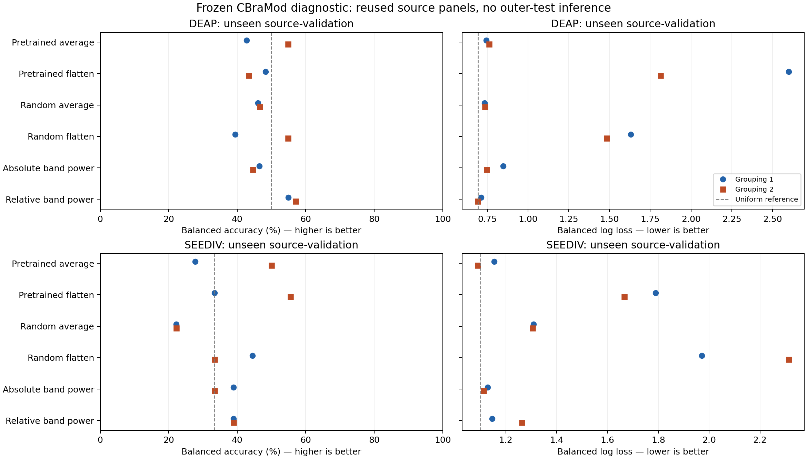

# CBraMod representation and preprocessing assessment

Completed 9 October 2026. **The frozen pretrained encoder improves SEED-IV loss over its random-initialization control, but does not consistently beat matched spectral features. DEAP gives no consistent pretrained advantage.** This does not justify a large held-out grid or a new conference contribution. All selected heads choose the smallest offered C, and flattened readouts strongly overfit; head regularization and full fine-tuning remain unresolved. The manuscript and research question are unchanged.

## What was assessed

[CBraMod's official ICLR 2025 implementation](https://github.com/wjq-learning/CBraMod) supplies a compact pretrained EEG encoder with documented TUEG clinical pretraining. The [primary paper](https://arxiv.org/html/2412.07236v3) evaluates emotion recognition on FACED and SEED-V, rather than our DEAP/SEED-IV tasks. We pinned the author code and released checkpoint, read both imported inference files, and used strict tensor-only weight loading. No remote code, author preprocessing script, installed environment change or model download at inference is used. The [protocol](CBraMod_Source_Probe_Protocol_2026-10-09.md) records source/weight revisions, licenses and input adaptations.

The author loaders use numerical microvolt amplitudes divided by 100 and 200 Hz patches, without our earlier trial z-scoring. The probe preserves native 32/62-channel order and the first forty stimulus seconds. DEAP's measured baseline is discarded; its available sixty-second preprocessed stimulus is Fourier-resampled before taking the prefix, without another bandpass. SEED-IV's available 200 Hz trials receive an MNE 1.10 zero-phase FIR 0.3–75 Hz filter before the prefix. This is a documented local adaptation: original continuous SEED-V CNT boundaries are unavailable, and DEAP interpolation cannot restore discarded frequencies. It is offline processing, not causal streaming.

Physical amplitude calibration is not independently authenticated. The local SEED-IV ReadMe does not specify calibrated units, and first-party DEAP recording authentication remains outstanding. Source-union median numerical RMS is 17.96 for DEAP and 13.99 for SEED-IV; maxima are 156.54 and 1,333.33. No high-amplitude trial is discarded or rescaled after inspecting results. These statistics expose input risk without diagnosing its cause. The released CBraMod card is minimal: TUEG pretraining is author-documented, but actual full checkpoint membership and target exclusion have not been independently certified.

## Fixed small source-only experiment

The declaration was pushed before feature extraction/task fitting in commit `d95f16245`. Its SHA256 is `a451f33256f9bd390b42a7830fc6f49739004aa8522f8b591e3fe11c467aed73`. Reuse both existing participant/video groupings, session 1/rotation 0/fold 0, unexposed arm. Each grouping's training and two validation panels exclude that grouping's outer-test people and videos. The union cache contains 740 DEAP and 270 SEED-IV source observations across groupings; a participant excluded in one grouping can belong to the other grouping's source panel. Original files contain other trials, but only the declared source observations are transformed. **No outer-test prediction is made.**

Each dataset/group compares six fixed representations: pretrained and random42 encoders with either 200-dimensional token averaging or native channel/patch flattening, plus matched absolute and relative four-band power from exactly the same native 200 Hz input. Four disjoint ten-second windows represent each observation. Flattening produces 64,000 DEAP or 124,000 SEED features and retains within-window temporal coordinates before averaging four windows. These are frozen linear probes, not the authors' full fine-tuning or published scores.

Training-only scalers and balanced logistic heads use C = 0.01/0.1/1/10. Equal-weight familiar/unseen validation class-balanced log loss selects each head; accuracy then stable candidate order break ties. All six models and four C candidates are retained for all four panels: **96 fits, 96 independent refits, 24 selected heads**. No global winning recipe, context fusion, joint-training result or unseen-corpus claim is selected from this diagnostic.

DEAP train counts are 358/344; each grouping has 32 unseen and 63 familiar validation observations from four validation participants. SEED-IV has 108 training observations and 12 unseen/36 familiar observations from three validation participants per grouping. The label targets remain corrected individual binary DEAP valence and SEED-IV's existing assigned coarse three-class task, with original labels retained locally. This is not native four-emotion SEED-IV supervision.

## Complete selected outcomes

Each slash separates **grouping 1 / grouping 2**, not seeds or independent cohorts. Higher balanced accuracy and lower balanced log loss are better. Every head selects C = 0.01. Uniform balanced-accuracy references are 50% for DEAP and 33.33% for SEED-IV; uniform losses are ln(2) = 0.6931 and ln(3) = 1.0986. These are reused source validation observations participating in hyperparameter selection, without population intervals or untouched test interpretation.

| DEAP model | Train BA (%) | Familiar BA (%) | Unseen BA (%) | Familiar loss | Unseen loss |
| --- | ---: | ---: | ---: | ---: | ---: |
| Pretrained average | 64.97 / 60.13 | 58.79 / 55.15 | 42.75 / 54.86 | 0.6773 / 0.7038 | 0.7434 / 0.7618 |
| Pretrained flatten | 100 / 100 | 44.70 / 47.09 | 48.24 / 43.32 | 2.5841 / 1.5667 | 2.5999 / 1.8125 |
| Random average | 64.16 / 66.69 | 43.48 / 39.86 | 46.08 / 46.56 | 0.7245 / 0.7277 | 0.7338 / 0.7357 |
| Random flatten | 100 / 100 | 46.52 / 55.15 | 39.41 / 54.86 | 1.9135 / 1.3641 | 1.6312 / 1.4814 |
| Absolute band power | 64.97 / 60.41 | 41.06 / 58.63 | 46.47 / 44.53 | 0.8350 / 0.7430 | 0.8486 / 0.7465 |
| Relative band power | 66.83 / 65.92 | 46.97 / 46.47 | 54.90 / 57.09 | 0.7039 / 0.7016 | 0.7118 / 0.6908 |

| SEED-IV model | Train BA (%) | Familiar BA (%) | Unseen BA (%) | Familiar loss | Unseen loss |
| --- | ---: | ---: | ---: | ---: | ---: |
| Pretrained average | 59.26 / 74.07 | 46.30 / 55.56 | 27.78 / 50.00 | 1.0774 / 1.0438 | 1.1545 / 1.0888 |
| Pretrained flatten | 100 / 100 | 40.74 / 53.70 | 33.33 / 55.56 | 1.1404 / 0.9802 | 1.7897 / 1.6663 |
| Random average | 62.96 / 70.37 | 42.59 / 42.59 | 22.22 / 22.22 | 1.1350 / 1.1045 | 1.3088 / 1.3053 |
| Random flatten | 100 / 100 | 48.15 / 46.30 | 44.44 / 33.33 | 1.5273 / 1.3520 | 1.9708 / 2.3137 |
| Absolute band power | 71.60 / 77.78 | 48.15 / 38.89 | 38.89 / 33.33 | 1.0673 / 1.0728 | 1.1280 / 1.1125 |
| Relative band power | 79.01 / 75.31 | 46.30 / 35.19 | 38.89 / 38.89 | 1.0454 / 1.2112 | 1.1458 / 1.2628 |

On SEED-IV, pretrained average unseen loss improves over random average by -0.1543/-0.2165. Against absolute spectral power, the differences are +0.0265/-0.0236; against relative power, +0.0087/-0.1740. Thus pretraining helps that encoder comparison, but superiority over both spectral controls is grouping-dependent. The pretrained flattened readout also reduces random-encoder loss, yet all flattened heads memorize training observations and have poor unseen losses. On DEAP, averaged pretrained unseen loss is worse than random average in both groupings and worse than relative spectral power. Familiar-panel gains do not establish robust unseen-material prediction.

All 24 selections land at the strongest regularization offered by the grid. With 64,000/124,000 standardized flattened features and only 108–358 training observations, the tested C range leaves a clear regularization question. It would be premature to conclude that the pretrained backbone is intrinsically unsuitable. The different dimensions, bandwidths relative to older studies, one random initialization and frozen readouts also preclude a general architecture ranking, convergence conclusion or full fine-tuning claim.

## Verification and resource use

Eight meaningful tests pass, including complete binary and three-class fitting, selected CSVs and independent candidate refits. Every candidate's training-only scaler/coefficient reproduces exactly; 288 candidate probability metric sets independently check with maximum discrepancy 2.67e-15 and zero probability-link error. All source/asset hashes remain unchanged. Eight designated source observations reprocess exactly from original mirror files; both encoders replay at batch one instead of four, with maximum feature discrepancy 1.04e-5. This does not regenerate every waveform or authenticate the external pretraining corpus.

A separately declared descriptive reanalysis checks all 72 selected metric sets from the locally retained row probabilities, all 12 matched panel metadata sets and all 96 pretrained-minus-random/spectral validation contrasts. Maximum selected metric discrepancy is 3.16e-14. It adds no fitting, confidence intervals or test inference. The PNG/SVG figure was visually inspected. [Aggregate verification](../../results/development/cbramod_source_probe_aggregate_2026-10-09/verification.json), [complete aggregate metrics](../../results/development/cbramod_source_probe_aggregate_2026-10-09/summary.json), [all candidates](../../results/development/cbramod_source_probe_aggregate_2026-10-09/all_candidate_metrics.json), and [all descriptive contrasts](../../results/development/cbramod_source_probe_aggregate_2026-10-09/postfit_analysis/contrasts.json).

An additional [aggregate-only publication check](../../results/development/cbramod_source_probe_aggregate_2026-10-09/publication_verification.json) independently recomputes all 96 paired differences within 2.23e-16, rechecks all 24 candidate selections and checks the exported tables for individual identity/probability/parameter fields. All 40 bound implementation sources and 18 upstream bindings remain exact. The aggregate scope is reviewed separately from the withheld per-trial evidence.

Frozen inference succeeds on the RTX 3050 6 GB. The synthetic pilot's peak allocated tensor memory is about 75 MiB; this excludes context/driver memory and is not a full fine-tuning estimate. An initial unactivated interpreter invocation could not resolve the existing NVRTC DLL; activating the user's `pytorch` environment fixes it without installations or mathematical changes. The preflight is preserved in the author asset audit.

## Publication scope and remaining work

Automatic approval review rejected a proposed push of trial-level EEG-derived outputs and participant metadata. **Code and aggregate-only evidence are the safer publication scope.** EEG, embeddings, coefficient arrays, row-level predictions and participant-linked input tables stay in the local study. Their publication requires additional explicit approval. Public aggregates permit inspection of the complete candidate grid and selected scores, but do not permit independent trial-level numerical reanalysis without the retained local evidence or a separately authorized reproduction. The initial protocol commit remains public; the rejected DEAP milestone command did not run.

This authorized assessment is complete. The next recommended small diagnostic is stronger source-only head regularization, followed by matched pretrained/random fine-tuning if warranted, with its own fixed budget and source-panel selection. Keep all outcomes, avoid outcome-driven preprocessing/participant exclusions, and assess native supervision/calibration suitability before a large grid. No such follow-up has been launched here. Success of an established encoder or normalization recipe would still require a distinct prior-work gap, broader matched evidence and an explicitly exploratory or freshly confirmed evaluation before a conference contribution is proposed.

The paper remains unready: first-party DEAP signal authentication, actual external checkpoint membership, physical calibration, historical result provenance, missing source figures, final novelty and the remaining architecture/joint/cross-corpus questions are unresolved. Before adopting a different research question, show the evidence and concrete proposal, obtain the author's explicit approval and immediately archive the then-current paper. The original source and PDF remain untouched and archived.
