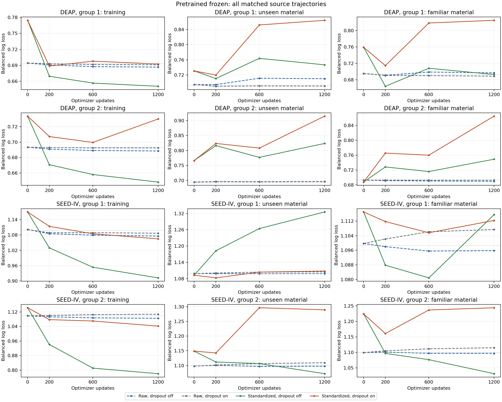
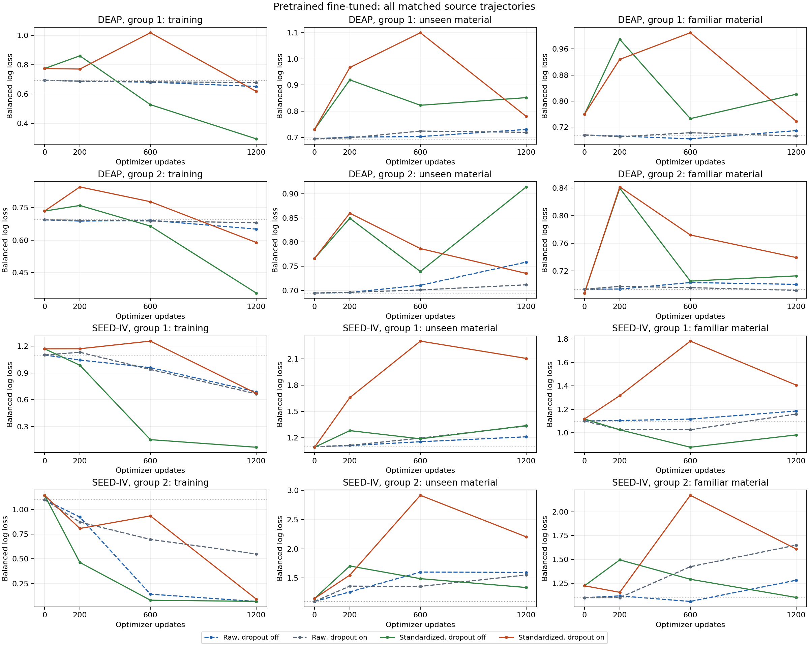
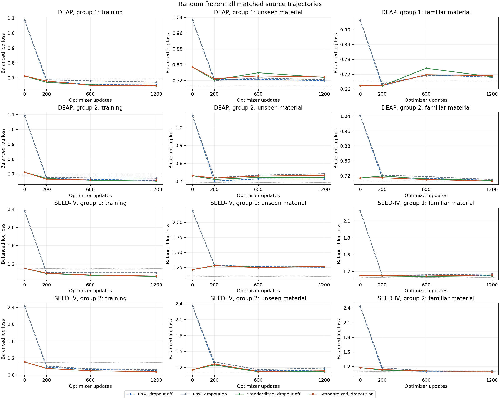
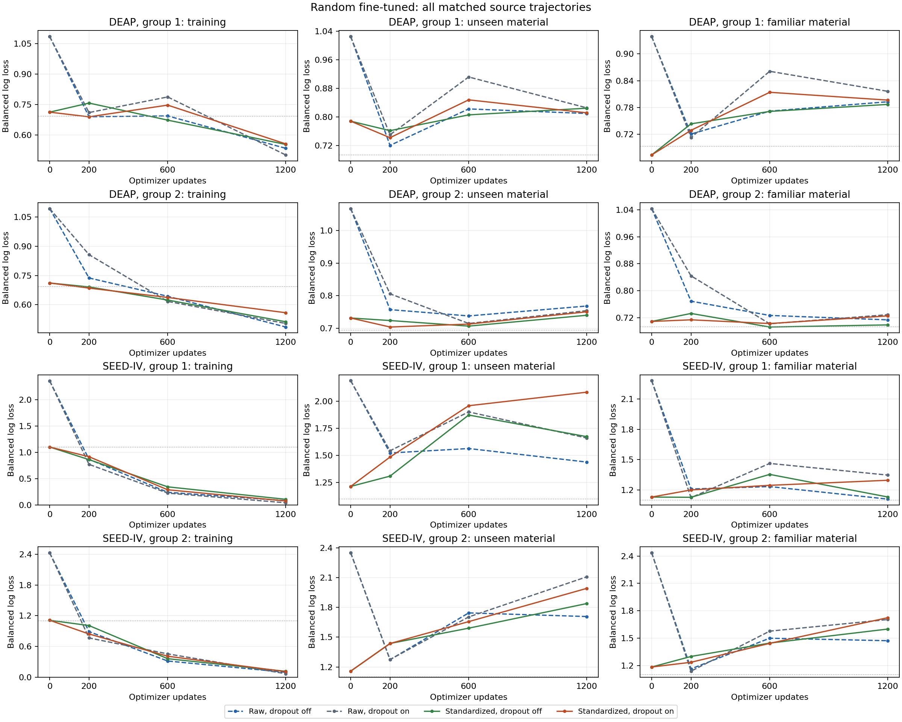
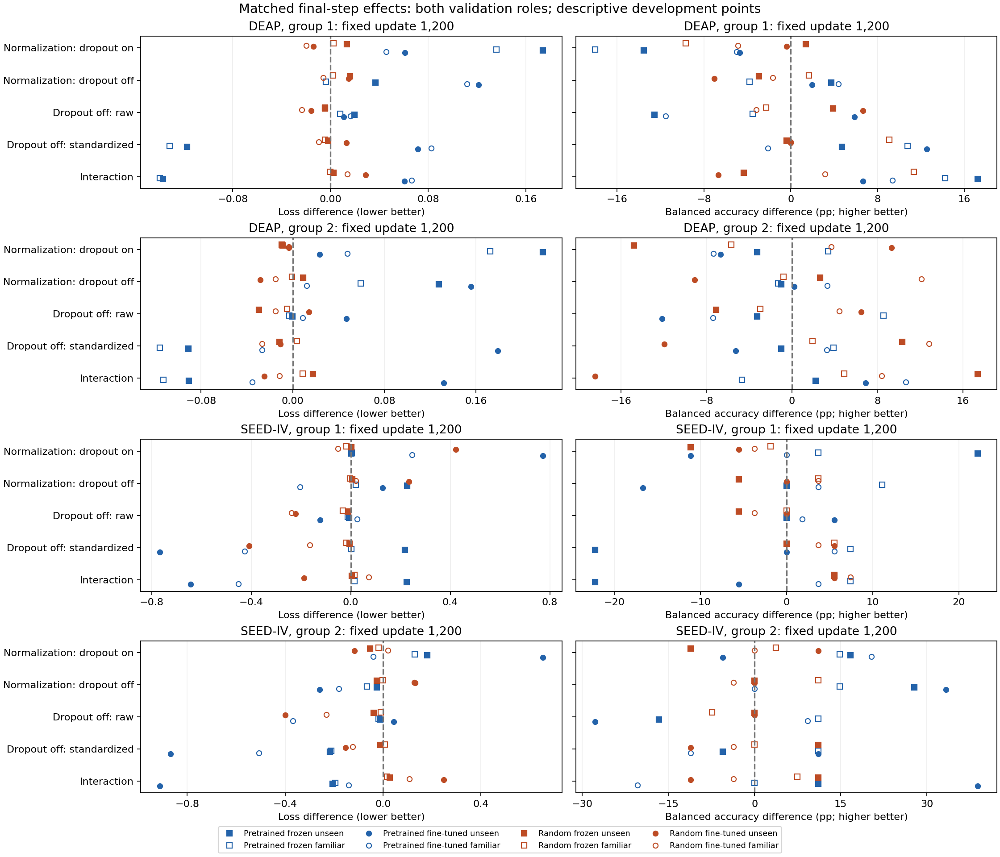

# Matched CBraMod embedding normalization and encoder dropout

Completed 9 October 2026. **All 64 conditions, 256 full states and 768 probability metric sets verify.** Sixteen raw/dropout-on controls are reused exactly; 48 new trajectories complete all 1,200 updates. Eight initial-encoder normalizers use only original training windows and remain fixed throughout fine-tuning. No outer-test inference, manuscript change or research-question pivot is made.

**Decision: the grid provides a source-fitting result, but no robust generalization lead that warrants a larger encoder study.** With pretrained fine-tuning, training-only standardization plus encoder dropout off raises final training BA from 57.58/58.02% to 93.24/91.34% on DEAP and from 69.14/67.28% to 100/100% on SEED-IV. Final unseen-validation loss is nevertheless 0.8519/0.9141 and 1.3400/1.3366, respectively, worse than uniform predictions on all four panels. These are grouping 1/2 results, not independent confirmation. The [contribution decision and bounded proposal](GRU-XNet_Contribution_Decision_2026-10-09.md) explain why the next step is adapter/target reassessment rather than another broad grid.

The [protocol](CBraMod_Conditioning_Protocol_2026-10-09.md) was frozen and pushed before task feature preparation/fitting in commit `0fd236f7f`. All 52 bound source/test files and predecessor bindings remain exact. Pretrained/random42 × frozen/trainable × raw/standardized × encoder dropout on/off are crossed in DEAP/SEED-IV groupings 1 and 2. Native 32/62-channel prepared 200-Hz forty-second inputs and four disjoint ten-second windows stay fixed. DEAP uses corrected individual binary valence; SEED-IV uses the existing assigned coarse three-class target, retaining original labels. Input calibration, preprocessing, original labels and exclusion rules are unchanged.

All conditions preserve head/random/dropout initialization seeds and exact balanced six-observation/window streams, pooling, optimizer, label smoothing, decay, global clipping and 1,200-update cosine schedule. Dropout-off disables all 61 module and internal-attention sites; it deliberately changes mask consumption while preserving observation/window streams. Raw bypasses affine arithmetic. Standardized embeddings use FP64 training-window moments and population standard deviations, floor 1e-6, then fixed FP32 buffers. They are never fitted to validation/current-encoder features. The head is a 200-dimensional pooled linear classifier, not the published default multilayer flattened fine-tuning head.

**Primary effects hold update duration fixed at 200/600/1,200.** Balanced log loss is primary and balanced accuracy secondary. Independently selected checkpoints are secondary because durations may differ. Initial probabilities are retained as diagnostics. All 1920 fixed-step and 480 selected contrast points are available, including 960 positive-step validation points. Every grouping and condition survives. Binary/three-class losses are not pooled into a common-task score; no global winning recipe or population interval is selected.

At the final matched step, normalization with dropout on worsens pretrained fine-tuned unseen loss in all four panels; normalization with dropout off worsens it in three. Disabling dropout on raw embeddings improves it in one of four panels. Disabling dropout on standardized embeddings improves both SEED-IV panels but worsens both DEAP panels. Frozen random heads have smaller unseen-loss improvements from disabling dropout in all four panels at either scaling, but their final losses still exceed uniform predictions. Thus the complete grid contains improvements without a convincing cross-panel predictive lead. Frequent clipping accompanies several fits; it is not an established explanation of their generalization failure.

Secondary checkpoint selection does not rescue the combined standardized/dropout-off pretrained recipe: unseen losses are 0.8228/0.7392 on DEAP and 1.1892/1.3366 on SEED-IV, still above uniform. An isolated accuracy improvement cannot override the declared primary loss. The full tables below preserve such outcomes, the earlier matched checkpoints and every random/frozen control.

## Complete fixed-update endpoints

Every slash separates grouping 1/grouping 2. BA is balanced accuracy in percent. Familiar and unseen validation exclude training participants; unseen validation also excludes training stimulus materials. The uniform reference is BA 50%/loss ln(2)=0.6931 for DEAP and BA 33.33%/loss ln(3)=1.0986 for SEED-IV. These are repeatedly reused development panels, not untouched test scores. Tables include every condition at update 1,200; complete 200/600/initial values remain in [all metrics](../../results/development/cbramod_conditioning_2026-10-09/postfit_analysis/all_metrics.csv).

### DEAP: fixed update 1,200

| Condition | Train BA (%) | Familiar BA (%) | Unseen BA (%) | Familiar loss | Unseen loss |
| --- | ---: | ---: | ---: | ---: | ---: |
| Pretrained frozen; raw; dropout on | 52.26 / 50.51 | 62.27 / 48.65 | 51.57 / 50.00 | 0.6891 / 0.6929 | 0.6906 / 0.6965 |
| Pretrained frozen; raw; dropout off | 56.53 / 57.68 | 58.79 / 57.22 | 39.02 / 46.76 | 0.6969 / 0.6898 | 0.7101 / 0.6962 |
| Pretrained frozen; standardized; dropout on | 56.42 / 52.14 | 44.24 / 52.03 | 38.04 / 46.76 | 0.8249 / 0.8651 | 0.8644 / 0.9146 |
| Pretrained frozen; standardized; dropout off | 62.66 / 63.33 | 55.00 / 55.93 | 42.75 / 45.75 | 0.6931 / 0.7492 | 0.7468 / 0.8235 |
| Pretrained fine-tuned; raw; dropout on | 57.58 / 58.02 | 56.36 / 59.62 | 42.35 / 53.85 | 0.6927 / 0.6917 | 0.7196 / 0.7117 |
| Pretrained fine-tuned; raw; dropout off | 62.76 / 64.70 | 44.85 / 52.23 | 48.24 / 41.70 | 0.7091 / 0.7003 | 0.7306 / 0.7586 |
| Pretrained fine-tuned; standardized; dropout on | 68.76 / 71.39 | 51.36 / 52.29 | 37.65 / 47.17 | 0.7382 / 0.7392 | 0.7804 / 0.7353 |
| Pretrained fine-tuned; standardized; dropout off | 93.24 / 91.34 | 49.24 / 55.56 | 50.20 / 41.90 | 0.8209 / 0.7126 | 0.8519 / 0.9141 |
| Random42 frozen; raw; dropout on | 56.51 / 57.89 | 51.82 / 54.78 | 47.65 / 51.21 | 0.7118 / 0.7005 | 0.7240 / 0.7424 |
| Random42 frozen; raw; dropout off | 63.53 / 64.75 | 49.55 / 51.82 | 51.57 / 44.13 | 0.7075 / 0.6956 | 0.7194 / 0.7130 |
| Random42 frozen; standardized; dropout on | 63.56 / 63.37 | 42.12 / 49.12 | 49.02 / 36.44 | 0.7143 / 0.6910 | 0.7376 / 0.7335 |
| Random42 frozen; standardized; dropout off | 64.57 / 63.93 | 51.21 / 51.04 | 48.63 / 46.76 | 0.7098 / 0.6948 | 0.7355 / 0.7219 |
| Random42 fine-tuned; raw; dropout on | 78.87 / 82.52 | 51.36 / 44.75 | 45.29 / 49.60 | 0.8162 / 0.7286 | 0.8254 / 0.7537 |
| Random42 fine-tuned; raw; dropout off | 78.17 / 88.52 | 48.18 / 49.17 | 51.96 / 56.07 | 0.7928 / 0.7133 | 0.8096 / 0.7679 |
| Random42 fine-tuned; standardized; dropout on | 70.56 / 72.33 | 46.52 / 48.44 | 44.90 / 58.91 | 0.7965 / 0.7250 | 0.8114 / 0.7501 |
| Random42 fine-tuned; standardized; dropout off | 75.86 / 83.14 | 46.52 / 61.28 | 44.90 / 46.96 | 0.7868 / 0.6983 | 0.8244 / 0.7394 |

### SEEDIV: fixed update 1,200

| Condition | Train BA (%) | Familiar BA (%) | Unseen BA (%) | Familiar loss | Unseen loss |
| --- | ---: | ---: | ---: | ---: | ---: |
| Pretrained frozen; raw; dropout on | 35.80 / 33.33 | 33.33 / 27.78 | 33.33 / 38.89 | 1.1073 / 1.1149 | 1.1051 / 1.1093 |
| Pretrained frozen; raw; dropout off | 38.27 / 54.94 | 33.33 / 38.89 | 33.33 / 22.22 | 1.0958 / 1.0969 | 1.0987 / 1.0975 |
| Pretrained frozen; standardized; dropout on | 46.91 / 46.91 | 37.04 / 42.59 | 55.56 / 55.56 | 1.1123 / 1.2439 | 1.1080 / 1.2894 |
| Pretrained frozen; standardized; dropout off | 67.90 / 85.80 | 44.44 / 53.70 | 33.33 / 50.00 | 1.1155 / 1.0314 | 1.3257 / 1.0720 |
| Pretrained fine-tuned; raw; dropout on | 69.14 / 67.28 | 44.44 / 35.19 | 33.33 / 44.44 | 1.1595 / 1.6501 | 1.3354 / 1.5518 |
| Pretrained fine-tuned; raw; dropout off | 77.16 / 100.00 | 46.30 / 44.44 | 38.89 / 16.67 | 1.1849 / 1.2824 | 1.2121 / 1.5958 |
| Pretrained fine-tuned; standardized; dropout on | 75.93 / 97.53 | 44.44 / 55.56 | 22.22 / 38.89 | 1.4065 / 1.6097 | 2.1068 / 2.2043 |
| Pretrained fine-tuned; standardized; dropout off | 100.00 / 100.00 | 50.00 / 44.44 | 22.22 / 50.00 | 0.9809 / 1.1019 | 1.3400 / 1.3366 |
| Random42 frozen; raw; dropout on | 41.36 / 61.73 | 35.19 / 33.33 | 33.33 / 33.33 | 1.1577 / 1.1145 | 1.2639 / 1.1905 |
| Random42 frozen; raw; dropout off | 65.43 / 66.67 | 35.19 / 25.93 | 27.78 / 33.33 | 1.1263 / 1.1058 | 1.2544 / 1.1516 |
| Random42 frozen; standardized; dropout on | 62.35 / 70.37 | 33.33 / 37.04 | 22.22 / 22.22 | 1.1403 / 1.0966 | 1.2661 / 1.1370 |
| Random42 frozen; standardized; dropout off | 67.90 / 71.60 | 38.89 / 37.04 | 22.22 / 33.33 | 1.1238 / 1.1038 | 1.2609 / 1.1259 |
| Random42 fine-tuned; raw; dropout on | 100.00 / 99.38 | 53.70 / 48.15 | 27.78 / 22.22 | 1.3472 / 1.7042 | 1.6610 / 2.1087 |
| Random42 fine-tuned; raw; dropout off | 100.00 / 100.00 | 50.00 / 48.15 | 27.78 / 22.22 | 1.1099 / 1.4721 | 1.4396 / 1.7083 |
| Random42 fine-tuned; standardized; dropout on | 100.00 / 98.77 | 50.00 / 48.15 | 22.22 / 33.33 | 1.2959 / 1.7241 | 2.0826 / 1.9921 |
| Random42 fine-tuned; standardized; dropout off | 100.00 / 99.38 | 53.70 / 44.44 | 27.78 / 22.22 | 1.1308 / 1.5996 | 1.6735 / 1.8391 |

## Matched final-step factor effects

Each entry is changed minus reference at the same update 1,200. Negative loss difference favors the changed condition; positive BA difference favors it. Normalization means standardized minus raw at the stated dropout. Dropout-off means off minus on at the stated scaling. Interaction is the normalization effect with dropout off minus its effect with dropout on; its sign alone is not an overall performance benefit. Earlier matched checkpoints and all initial/training contrasts are retained in [complete contrasts](../../results/development/cbramod_conditioning_2026-10-09/postfit_analysis/contrasts.json).

### DEAP: all factor effects

| Encoder | Contrast | Train loss delta | Familiar loss delta | Unseen loss delta | Unseen BA delta (pp) |
| --- | --- | ---: | ---: | ---: | ---: |
| Pretrained frozen | Normalization, dropout on | 0.0013 / 0.0374 | 0.1358 / 0.1722 | 0.1738 / 0.2181 | -13.53 / -3.24 |
| Pretrained frozen | Normalization, dropout off | -0.0360 / -0.0403 | -0.0038 / 0.0594 | 0.0367 / 0.1273 | 3.73 / -1.01 |
| Pretrained frozen | Dropout off, raw | -0.0045 / -0.0040 | 0.0079 / -0.0031 | 0.0195 / -0.0003 | -12.55 / -3.24 |
| Pretrained frozen | Dropout off, standardized | -0.0418 / -0.0818 | -0.1318 / -0.1159 | -0.1176 / -0.0911 | 4.71 / -1.01 |
| Pretrained frozen | Interaction | -0.0373 / -0.0778 | -0.1397 / -0.1128 | -0.1371 / -0.0908 | 17.25 / 2.23 |
| Pretrained fine-tuned | Normalization, dropout on | -0.0603 / -0.0908 | 0.0455 / 0.0476 | 0.0608 / 0.0236 | -4.71 / -6.68 |
| Pretrained fine-tuned | Normalization, dropout off | -0.3582 / -0.2941 | 0.1118 / 0.0123 | 0.1213 / 0.1555 | 1.96 / 0.20 |
| Pretrained fine-tuned | Dropout off, raw | -0.0262 / -0.0293 | 0.0164 / 0.0087 | 0.0110 / 0.0470 | 5.88 / -12.15 |
| Pretrained fine-tuned | Dropout off, standardized | -0.3241 / -0.2326 | 0.0827 / -0.0266 | 0.0715 / 0.1788 | 12.55 / -5.26 |
| Pretrained fine-tuned | Interaction | -0.2979 / -0.2034 | 0.0663 / -0.0353 | 0.0606 / 0.1319 | 6.67 / 6.88 |
| Random42 frozen | Normalization, dropout on | -0.0227 / -0.0141 | 0.0025 / -0.0095 | 0.0136 / -0.0089 | 1.37 / -14.78 |
| Random42 frozen | Normalization, dropout off | -0.0058 / -0.0045 | 0.0023 / -0.0008 | 0.0161 / 0.0089 | -2.94 / 2.63 |
| Random42 frozen | Dropout off, raw | -0.0185 / -0.0167 | -0.0043 / -0.0049 | -0.0046 / -0.0294 | 3.92 / -7.09 |
| Random42 frozen | Dropout off, standardized | -0.0015 / -0.0070 | -0.0046 / 0.0038 | -0.0021 / -0.0116 | -0.39 / 10.32 |
| Random42 frozen | Interaction | 0.0170 / 0.0097 | -0.0002 / 0.0087 | 0.0025 / 0.0177 | -4.31 / 17.41 |
| Random42 fine-tuned | Normalization, dropout on | 0.0546 / 0.0551 | -0.0197 / -0.0035 | -0.0140 / -0.0036 | -0.39 / 9.31 |
| Random42 fine-tuned | Normalization, dropout off | 0.0193 / 0.0270 | -0.0060 / -0.0150 | 0.0147 / -0.0285 | -7.06 / -9.11 |
| Random42 fine-tuned | Dropout off, raw | 0.0328 / -0.0184 | -0.0234 / -0.0153 | -0.0158 / 0.0142 | 6.67 / 6.48 |
| Random42 fine-tuned | Dropout off, standardized | -0.0026 / -0.0464 | -0.0097 / -0.0268 | 0.0130 / -0.0107 | 0.00 / -11.94 |
| Random42 fine-tuned | Interaction | -0.0354 / -0.0280 | 0.0137 / -0.0115 | 0.0287 / -0.0249 | -6.67 / -18.42 |

### SEEDIV: all factor effects

| Encoder | Contrast | Train loss delta | Familiar loss delta | Unseen loss delta | Unseen BA delta (pp) |
| --- | --- | ---: | ---: | ---: | ---: |
| Pretrained frozen | Normalization, dropout on | -0.0221 / -0.0652 | 0.0050 / 0.1289 | 0.0030 / 0.1802 | 22.22 / 16.67 |
| Pretrained frozen | Normalization, dropout off | -0.1640 / -0.3047 | 0.0197 / -0.0655 | 0.2270 / -0.0254 | 0.00 / 27.78 |
| Pretrained frozen | Dropout off, raw | -0.0114 / -0.0223 | -0.0115 / -0.0180 | -0.0064 / -0.0118 | 0.00 / -16.67 |
| Pretrained frozen | Dropout off, standardized | -0.1533 / -0.2618 | 0.0032 / -0.2125 | 0.2176 / -0.2174 | -22.22 / -5.56 |
| Pretrained frozen | Interaction | -0.1419 / -0.2395 | 0.0147 / -0.1945 | 0.2240 / -0.2056 | -22.22 / 11.11 |
| Pretrained fine-tuned | Normalization, dropout on | 0.0050 / -0.4565 | 0.2470 / -0.0404 | 0.7714 / 0.6524 | -11.11 / -5.56 |
| Pretrained fine-tuned | Normalization, dropout off | -0.6209 / 0.0008 | -0.2040 / -0.1805 | 0.1279 / -0.2592 | -16.67 / 33.33 |
| Pretrained fine-tuned | Dropout off, raw | 0.0227 / -0.4802 | 0.0253 / -0.3677 | -0.1233 / 0.0440 | 5.56 / -27.78 |
| Pretrained fine-tuned | Dropout off, standardized | -0.6031 / -0.0229 | -0.4256 / -0.5078 | -0.7668 / -0.8677 | 0.00 / 11.11 |
| Pretrained fine-tuned | Interaction | -0.6258 / 0.4573 | -0.4510 / -0.1401 | -0.6435 / -0.9117 | -5.56 / 38.89 |
| Random42 frozen | Normalization, dropout on | -0.0743 / -0.0509 | -0.0174 / -0.0179 | 0.0022 / -0.0534 | -11.11 / -11.11 |
| Random42 frozen | Normalization, dropout off | -0.0089 / -0.0308 | -0.0025 / -0.0020 | 0.0065 / -0.0257 | -5.56 / 0.00 |
| Random42 frozen | Dropout off, raw | -0.0751 / -0.0164 | -0.0313 / -0.0087 | -0.0095 / -0.0389 | -5.56 / 0.00 |
| Random42 frozen | Dropout off, standardized | -0.0097 / 0.0037 | -0.0164 / 0.0072 | -0.0052 / -0.0112 | 0.00 / 11.11 |
| Random42 frozen | Interaction | 0.0654 / 0.0201 | 0.0149 / 0.0159 | 0.0043 / 0.0278 | 5.56 / 11.11 |
| Random42 fine-tuned | Normalization, dropout on | 0.0337 / 0.0400 | -0.0513 / 0.0199 | 0.4216 / -0.1166 | -5.56 / 11.11 |
| Random42 fine-tuned | Normalization, dropout off | 0.0265 / 0.0191 | 0.0209 / 0.1275 | 0.2339 / 0.1307 | 0.00 / 0.00 |
| Random42 fine-tuned | Dropout off, raw | 0.0392 / 0.0277 | -0.2373 / -0.2321 | -0.2214 / -0.4004 | 0.00 / 0.00 |
| Random42 fine-tuned | Dropout off, standardized | 0.0321 / 0.0068 | -0.1651 / -0.1245 | -0.4091 / -0.1531 | 5.56 / -11.11 |
| Random42 fine-tuned | Interaction | -0.0071 / -0.0209 | 0.0722 / 0.1076 | -0.1877 / 0.2473 | 5.56 / -11.11 |

## Checkpoint-selected outcomes: secondary

Each trajectory selects among 200/600/1,200 by equal familiar/unseen balanced loss, then mean BA and stable first candidate. All 64 selections independently verify; 32/64 select 200. Differing durations make these secondary comparisons. A selected-validation score is not an independent test gain.

### DEAP: all selected conditions

| Condition | Selected updates | Train BA (%) | Familiar BA (%) | Unseen BA (%) | Familiar loss | Unseen loss |
| --- | --- | ---: | ---: | ---: | ---: | ---: |
| Pretrained frozen; raw; dropout on | 1200 / 600 | 52.26 / 50.51 | 62.27 / 49.22 | 51.57 / 44.74 | 0.6891 / 0.6929 | 0.6906 / 0.6960 |
| Pretrained frozen; raw; dropout off | 200 / 1200 | 55.20 / 57.68 | 66.06 / 57.22 | 45.69 / 46.76 | 0.6913 / 0.6898 | 0.6945 / 0.6962 |
| Pretrained frozen; standardized; dropout on | 200 / 600 | 55.60 / 53.52 | 61.82 / 54.16 | 64.90 / 45.55 | 0.7146 / 0.7601 | 0.7197 / 0.8080 |
| Pretrained frozen; standardized; dropout off | 200 / 600 | 61.66 / 60.82 | 60.91 / 45.32 | 54.90 / 39.27 | 0.6644 / 0.7161 | 0.7105 / 0.7771 |
| Pretrained fine-tuned; raw; dropout on | 200 / 200 | 56.19 / 52.76 | 57.27 / 43.81 | 44.90 / 42.11 | 0.6902 / 0.6974 | 0.6988 / 0.6962 |
| Pretrained fine-tuned; raw; dropout off | 600 / 200 | 56.86 / 54.85 | 49.55 / 51.66 | 49.41 / 46.96 | 0.6838 / 0.6935 | 0.7035 / 0.6959 |
| Pretrained fine-tuned; standardized; dropout on | 1200 / 1200 | 68.76 / 71.39 | 51.36 / 52.29 | 37.65 / 47.17 | 0.7382 / 0.7392 | 0.7804 / 0.7353 |
| Pretrained fine-tuned; standardized; dropout off | 600 / 600 | 76.42 / 51.62 | 44.09 / 50.00 | 47.25 / 52.63 | 0.7460 / 0.7050 | 0.8228 / 0.7392 |
| Random42 frozen; raw; dropout on | 200 / 1200 | 56.46 / 57.89 | 55.00 / 54.78 | 50.98 / 51.21 | 0.6816 / 0.7005 | 0.7200 / 0.7424 |
| Random42 frozen; raw; dropout off | 200 / 1200 | 58.06 / 64.75 | 51.36 / 51.82 | 50.59 / 44.13 | 0.6740 / 0.6956 | 0.7252 / 0.7130 |
| Random42 frozen; standardized; dropout on | 200 / 1200 | 57.81 / 63.37 | 50.91 / 49.12 | 50.59 / 36.44 | 0.6752 / 0.6910 | 0.7295 / 0.7335 |
| Random42 frozen; standardized; dropout off | 200 / 1200 | 58.30 / 63.93 | 52.42 / 51.04 | 53.53 / 46.76 | 0.6731 / 0.6948 | 0.7226 / 0.7219 |
| Random42 fine-tuned; raw; dropout on | 200 / 600 | 54.62 / 71.47 | 50.15 / 49.12 | 50.20 / 40.28 | 0.7128 / 0.7016 | 0.7499 / 0.7142 |
| Random42 fine-tuned; raw; dropout off | 200 / 600 | 54.57 / 55.67 | 48.48 / 50.78 | 50.00 / 50.00 | 0.7205 / 0.7264 | 0.7200 / 0.7374 |
| Random42 fine-tuned; standardized; dropout on | 200 / 600 | 53.57 / 61.55 | 50.30 / 48.44 | 47.45 / 57.69 | 0.7289 / 0.7023 | 0.7416 / 0.7123 |
| Random42 fine-tuned; standardized; dropout off | 200 / 600 | 50.92 / 68.82 | 49.70 / 49.95 | 61.37 / 57.49 | 0.7434 / 0.6920 | 0.7614 / 0.7061 |

### SEEDIV: all selected conditions

| Condition | Selected updates | Train BA (%) | Familiar BA (%) | Unseen BA (%) | Familiar loss | Unseen loss |
| --- | --- | ---: | ---: | ---: | ---: | ---: |
| Pretrained frozen; raw; dropout on | 200 / 200 | 37.65 / 33.95 | 22.22 / 33.33 | 38.89 / 38.89 | 1.1022 / 1.1050 | 1.1009 / 1.1015 |
| Pretrained frozen; raw; dropout off | 600 / 600 | 37.04 / 56.17 | 40.74 / 44.44 | 33.33 / 22.22 | 1.0956 / 1.0971 | 1.0984 / 1.0968 |
| Pretrained frozen; standardized; dropout on | 200 / 200 | 40.12 / 38.27 | 33.33 / 38.89 | 38.89 / 33.33 | 1.1117 / 1.1608 | 1.0830 / 1.1426 |
| Pretrained frozen; standardized; dropout off | 200 / 1200 | 56.17 / 85.80 | 44.44 / 53.70 | 27.78 / 50.00 | 1.0879 / 1.0314 | 1.1827 / 1.0720 |
| Pretrained fine-tuned; raw; dropout on | 200 / 200 | 38.27 / 55.56 | 46.30 / 46.30 | 44.44 / 33.33 | 1.0262 / 1.0998 | 1.1151 / 1.3602 |
| Pretrained fine-tuned; raw; dropout off | 200 / 200 | 46.30 / 64.20 | 33.33 / 44.44 | 33.33 / 16.67 | 1.1039 / 1.1179 | 1.1119 / 1.2610 |
| Pretrained fine-tuned; standardized; dropout on | 200 / 200 | 44.44 / 68.52 | 31.48 / 46.30 | 33.33 / 27.78 | 1.3163 / 1.1555 | 1.6593 / 1.5486 |
| Pretrained fine-tuned; standardized; dropout off | 600 / 1200 | 98.77 / 100.00 | 57.41 / 44.44 | 38.89 / 50.00 | 0.8756 / 1.1019 | 1.1892 / 1.3366 |
| Random42 frozen; raw; dropout on | 600 / 600 | 43.21 / 58.64 | 38.89 / 38.89 | 33.33 / 22.22 | 1.1428 / 1.1148 | 1.2537 / 1.1600 |
| Random42 frozen; raw; dropout off | 1200 / 600 | 65.43 / 61.73 | 35.19 / 42.59 | 27.78 / 16.67 | 1.1263 / 1.1024 | 1.2544 / 1.1346 |
| Random42 frozen; standardized; dropout on | 600 / 1200 | 61.73 / 70.37 | 46.30 / 37.04 | 33.33 / 22.22 | 1.1212 / 1.0966 | 1.2469 / 1.1370 |
| Random42 frozen; standardized; dropout off | 600 / 1200 | 61.11 / 71.60 | 33.33 / 37.04 | 27.78 / 33.33 | 1.1119 / 1.1038 | 1.2532 / 1.1259 |
| Random42 fine-tuned; raw; dropout on | 200 / 200 | 64.20 / 72.84 | 48.15 / 40.74 | 22.22 / 38.89 | 1.1242 / 1.1382 | 1.5434 / 1.2744 |
| Random42 fine-tuned; raw; dropout off | 1200 / 200 | 100.00 / 63.58 | 50.00 / 46.30 | 27.78 / 22.22 | 1.1099 / 1.1633 | 1.4396 / 1.2724 |
| Random42 fine-tuned; standardized; dropout on | 200 / 200 | 53.70 / 62.96 | 44.44 / 42.59 | 16.67 / 33.33 | 1.2004 / 1.2357 | 1.4853 / 1.4358 |
| Random42 fine-tuned; standardized; dropout off | 200 / 200 | 72.22 / 61.73 | 42.59 / 40.74 | 33.33 / 33.33 | 1.1276 / 1.2995 | 1.3099 / 1.4364 |

## Source-only statistics, clipping and numerical checks

The eight source statistic sets independently replay the canonical-batch features exactly and reproduce FP64 moments with maximum discrepancy 0.00e+00. The alternate batch-8 training-feature diagnostic has maximum raw discrepancy 3.81e-06, and standardized discrepancy 8.70e-06. This is a numerical diagnostic, not whole-model batch invariance. Complete-state replay uses canonical batch 16, FP32 and the explicit backbone/token-mean/fixed-affine/functional-linear operator order. Maximum full-state probability discrepancy is 1.11e-16; maximum replay metric discrepancy is 0.00e+00. Public metric recomputation differs by at most 5.86e-14.

New histories retain clipping counts across every 100-update interval. Reused controls lack those counts and are excluded from frequency estimates. The following frequencies are actual preclip norms exceeding 1 among all 1,200 updates of each new trajectory; gradient clipping is an observation, not proof of the cause of weak generalization.

| Dataset | New condition | Updates clipped (%), groups 1 / 2 |
| --- | --- | ---: |
| DEAP | Pretrained frozen; raw; dropout off | 0.00 / 0.00 |
| DEAP | Pretrained frozen; standardized; dropout on | 100.00 / 100.00 |
| DEAP | Pretrained frozen; standardized; dropout off | 99.92 / 100.00 |
| DEAP | Pretrained fine-tuned; raw; dropout off | 93.00 / 83.42 |
| DEAP | Pretrained fine-tuned; standardized; dropout on | 100.00 / 100.00 |
| DEAP | Pretrained fine-tuned; standardized; dropout off | 100.00 / 100.00 |
| DEAP | Random42 frozen; raw; dropout off | 100.00 / 100.00 |
| DEAP | Random42 frozen; standardized; dropout on | 100.00 / 100.00 |
| DEAP | Random42 frozen; standardized; dropout off | 100.00 / 100.00 |
| DEAP | Random42 fine-tuned; raw; dropout off | 100.00 / 100.00 |
| DEAP | Random42 fine-tuned; standardized; dropout on | 100.00 / 100.00 |
| DEAP | Random42 fine-tuned; standardized; dropout off | 100.00 / 100.00 |
| SEEDIV | Pretrained frozen; raw; dropout off | 2.83 / 0.00 |
| SEEDIV | Pretrained frozen; standardized; dropout on | 99.50 / 100.00 |
| SEEDIV | Pretrained frozen; standardized; dropout off | 99.83 / 100.00 |
| SEEDIV | Pretrained fine-tuned; raw; dropout off | 98.83 / 82.50 |
| SEEDIV | Pretrained fine-tuned; standardized; dropout on | 100.00 / 100.00 |
| SEEDIV | Pretrained fine-tuned; standardized; dropout off | 99.33 / 98.67 |
| SEEDIV | Random42 frozen; raw; dropout off | 100.00 / 100.00 |
| SEEDIV | Random42 frozen; standardized; dropout on | 100.00 / 100.00 |
| SEEDIV | Random42 frozen; standardized; dropout off | 100.00 / 100.00 |
| SEEDIV | Random42 fine-tuned; raw; dropout off | 99.83 / 100.00 |
| SEEDIV | Random42 fine-tuned; standardized; dropout on | 100.00 / 100.00 |
| SEEDIV | Random42 fine-tuned; standardized; dropout off | 100.00 / 100.00 |

The public audit checks all 768 metric sets, 64 selections, 192 reconstructed exposure points, 768 history points, eight normalizer proofs, sixteen byte-exact anchors, paired initializations/streams and four participant/trial/material role boundaries. Peak actual tensor allocation is 0.946 GiB, excluding driver/desktop memory. Thirty fitting-related tests and two independent interaction-analysis checks pass.

## Figures and reproducibility

The five original PNG/SVG pairs in `postfit_analysis/` remain exact. A separately bound presentation revision in `linear_figures/` uses linear axes with readable numeric ticks, reproduces all 768 loss coordinates and 320 final validation-effect coordinates, and changes no numerical outcome. All five revised PNGs were visually inspected, including legends and axis labels; standalone SVGs are retained.











Public-only numerical verification needs no GPU/raw EEG:

```powershell
conda activate pytorch
python scripts/analyze_cbramod_conditioning.py verify
python scripts/plot_cbramod_conditioning.py verify
python scripts/verify_publication_export.py --export-only
```

Run from `GRU-XNet_EEG_Emotion_Recognition/`. Local full-state checking additionally requires retained datasets, official assets, scaler arrays and checkpoints. [Fitting proof](../../results/development/cbramod_conditioning_2026-10-09/verification.json), [independent public proof](../../results/development/cbramod_conditioning_2026-10-09/postfit_analysis/verification.json), [all selections](../../results/development/cbramod_conditioning_2026-10-09/summary.json), [gradient histories](../../results/development/cbramod_conditioning_2026-10-09/postfit_analysis/gradient_history.csv), [source exposure](../../results/development/cbramod_conditioning_2026-10-09/postfit_analysis/training_exposure.csv), [normalizer diagnostics](../../results/development/cbramod_conditioning_2026-10-09/postfit_analysis/normalizer_diagnostics.csv), [canonical export](../../results/development/cbramod_conditioning_2026-10-09/export_manifest.json).

Verified probabilities, labels and anonymous references are released under the author's existing explicit approval. EEG, embeddings, scaler/weight arrays, coefficients and per-trial physical amplitudes remain local. State replay checks model/output integrity, not every optimizer update or external recording/pretraining authenticity.

## Interpretation and decision gate

These matched controls isolate the tested embedding conditioning and encoder dropout recipe. They do not test native four-emotion SEED-IV, complete joint training, unseen-corpus transfer or all published CBraMod adapters. One head/random initialization and repeatedly reused source panels cannot establish population confirmation. Physical input calibration, first-party DEAP signal authentication, actual checkpoint training membership and historical result/figure provenance remain unresolved.

Full-source fitting is now demonstrated under the combined standardized/dropout-off pretrained recipe, without a reliable predictive lead. This resolves the narrower capacity concern under that recipe; it does not establish convergence, adequacy of the raw/default recipe or useful emotion generalization. There is no qualifying lead for a larger confirmation programme from this grid. The [decision proposal](GRU-XNet_Contribution_Decision_2026-10-09.md) recommends a bounded authenticated-head control before any larger encoder expansion; it is not launched or adopted by this report.

A better normalization/dropout recipe for an existing model is not itself scientific novelty. The [contribution research update](GRU-XNet_Contribution_Research_Update_2026-10-09.md) records close prior work and a limited official-readout shape audit. Any actual changed main question still requires measured findings, a concrete proposal, explicit author approval and a fresh archive immediately before adoption. The manuscript and current question remain unchanged.
