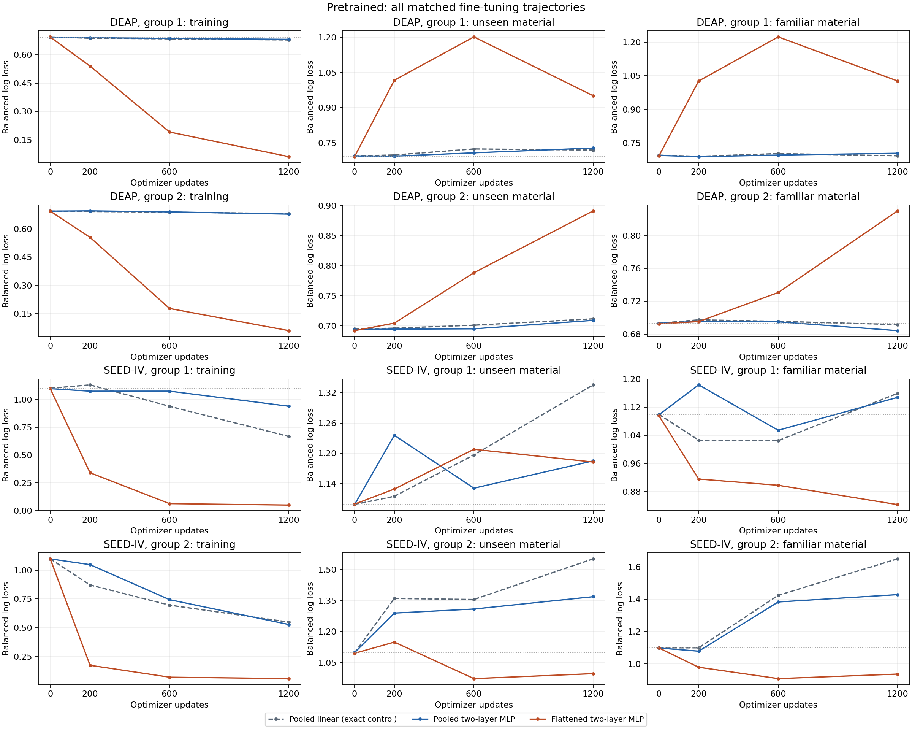
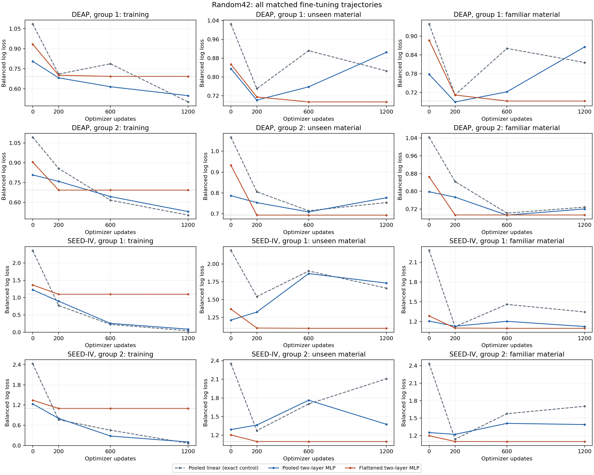
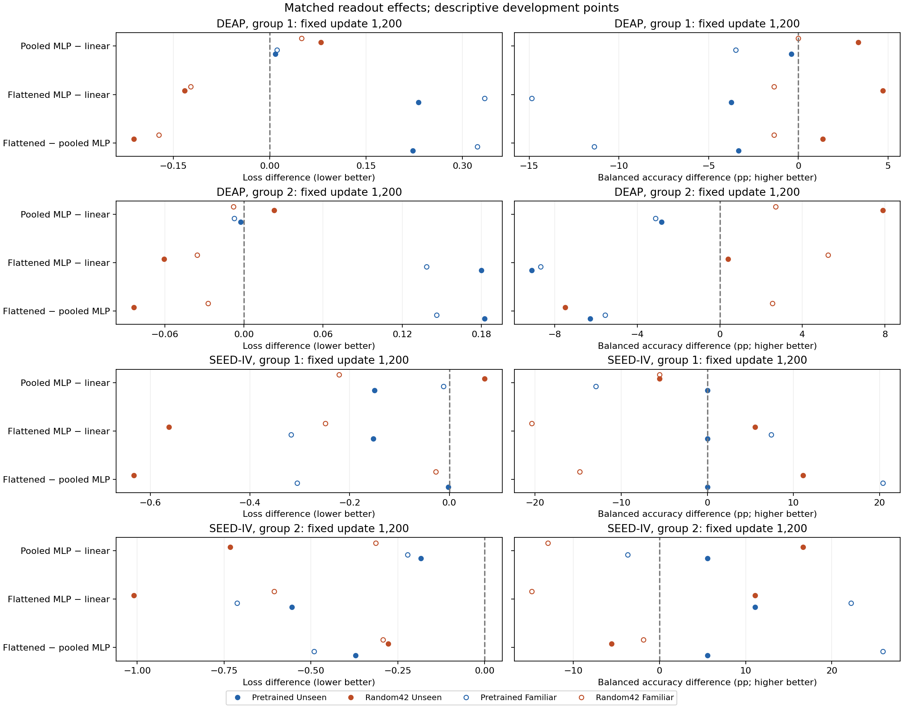
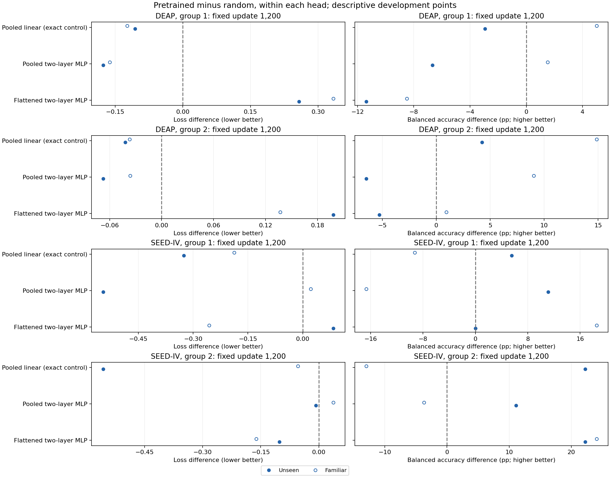

# Matched nonlinear CBraMod readout findings

Declared 9 October 2026; completion recorded at `2026-10-09T19:43:14.886753+00:00`. **All 24 conditions, 96 full states and 288 probability metric sets verify:** sixteen new 1,200-update trajectories and eight exact pooled-linear controls. Forty relevant pre-fit tests, four supplementary boundary tests and a complete synthetic public-grid audit pass. No new outer-test inference, label change, manuscript change or adopted main question is made.

The [protocol](CBraMod_Readout_Protocol_2026-10-09.md) and [declaration](../../results/development/cbramod_readout_2026-10-09/plan.json) were pushed before task fitting in commit `6a791a4a5`. All 60 frozen source/analysis/test files remain exact. The [pre-fit boundary adapter](../../results/development/cbramod_readout_2026-10-09/analysis_boundary_adapter_declaration.json) preserves the original analyzer while correcting its overly strict validation-subject guard. Training people are excluded from both validation roles; familiar/unseen validation deliberately share held-out people with disjoint trials. All trial and material exclusions remain unchanged. The adapter was declared with zero new trajectories begun; four rejection/acceptance tests and a complete synthetic-only public-grid replay cover it.

The [interpretation and decision](GRU-XNet_Readout_Decision_2026-10-09.md) distinguish a useful predictive lead from training-only improvement. The tables below retain all conditions and primary/secondary outcomes; no global winning head or population interval is selected.

## What is matched

DEAP/SEED-IV grouping 1/2 retain native 32/62-channel prepared 200-Hz forty-second arrays divided by 100, four disjoint ten-second windows, corrected individual binary DEAP valence and assigned coarse three-class SEED-IV labels. All cases fine-tune the same pretrained/random42 encoder with encoder dropout on. Head initialization seed 4242, the exact balanced observation/window streams, AdamW rates 0.001/0.0001, decay 0.05, smoothing 0.1, clipping 1 and 1,200-update cosine schedule are fixed.

Pooled linear controls average tokens into 200 dimensions. New pooled/flattened MLPs use a 200-hidden-unit linear layer, ELU, dropout 0.1 and a two-/three-class output. Head parameter counts are 402/603 for linear, 40,602/40,803 for pooled MLP and 12,800,602/24,800,803 for flattened MLP. Head-family changes add dropout; flattening adds parameters and retains positional information. These are not pure pooling or capacity effects. New head dropout uses a separate `424243 + update` stream and restores the encoder's global RNG. Exact CPU/CUDA mask and RNG checks pass.

Pinned author two-layer operators, outputs and input/parameter gradients match in synthetic training/evaluation checks. The SEED-V standalone input adapts one to ten patches and bypasses premature wrapper flattening; the pooled control supplies mean tokens. These are explicit adapters, not reproductions of published CBraMod scores or the larger default three-layer head. Existing physical calibration, recording authentication and checkpoint membership limits remain.

## Source panel coverage

Entries show people / trials / materials. Four windows from a trial do not create four independent observations. Familiar and unseen validation share the same held-out people, with different trials/material sets. Both validation roles are repeatedly reused development data.

DEAP inherits the earlier deterministic per-training-participant/class matching between exposed and unexposed arms. Eligible training-participant labels from both arms determine retained counts; no new matching or exclusion is introduced here. The current head comparisons are conditional on that prepared population, rather than every available source trial. A strictly sealed new-material confirmation should construct its source population without consulting labels from the excluded materials, including labels from training participants.

| Dataset/group | Training | Familiar validation | Unseen validation |
| --- | ---: | ---: | ---: |
| DEAP / 1 | 24 / 358 / 16 | 4 / 63 / 16 | 4 / 32 / 8 |
| DEAP / 2 | 24 / 344 / 16 | 4 / 63 / 16 | 4 / 32 / 8 |
| SEEDIV / 1 | 9 / 108 / 12 | 3 / 36 / 12 | 3 / 12 / 4 |
| SEEDIV / 2 | 9 / 108 / 12 | 3 / 36 / 12 | 3 / 12 / 4 |

SEED-IV unseen validation has only twelve trials from three people and four materials per grouping; DEAP has thirty-two trials from four people and eight materials. Apparent BA differences can therefore come from a few predictions. The two groupings are not independent population replications.

## Complete fixed-duration results

Slashes separate grouping 1 / grouping 2. BA is balanced accuracy in percent. Balanced log loss is primary; BA is secondary. Uniform references are loss 0.6931/BA 50% on DEAP and loss 1.0986/BA 33.33% on SEED-IV. These small repeatedly reused source-validation panels are development evidence, not independent tests. All 0/200/600/1,200 outcomes remain in [all metrics](../../results/development/cbramod_readout_2026-10-09/postfit_analysis/all_metrics.csv).

### DEAP: fixed update 1,200

| Encoder/head | Train BA (%) | Familiar BA (%) | Unseen BA (%) | Familiar loss | Unseen loss |
| --- | ---: | ---: | ---: | ---: | ---: |
| Pretrained / Pooled linear | 57.58 / 58.02 | 56.36 / 59.62 | 42.35 / 53.85 | 0.6927 / 0.6917 | 0.7196 / 0.7117 |
| Pretrained / Pooled MLP | 57.63 / 60.26 | 52.88 / 56.50 | 41.96 / 51.01 | 0.7041 / 0.6842 | 0.7283 / 0.7091 |
| Pretrained / Flattened MLP | 100.00 / 99.75 | 41.52 / 50.94 | 38.63 / 44.74 | 1.0270 / 0.8302 | 0.9509 / 0.8916 |
| Random42 / Pooled linear | 78.87 / 82.52 | 51.36 / 44.75 | 45.29 / 49.60 | 0.8162 / 0.7286 | 0.8254 / 0.7537 |
| Random42 / Pooled MLP | 72.60 / 78.16 | 51.36 / 47.45 | 48.63 / 57.49 | 0.8657 / 0.7205 | 0.9049 / 0.7767 |
| Random42 / Flattened MLP | 50.00 / 50.00 | 50.00 / 50.00 | 50.00 / 50.00 | 0.6931 / 0.6931 | 0.6931 / 0.6931 |

### SEEDIV: fixed update 1,200

| Encoder/head | Train BA (%) | Familiar BA (%) | Unseen BA (%) | Familiar loss | Unseen loss |
| --- | ---: | ---: | ---: | ---: | ---: |
| Pretrained / Pooled linear | 69.14 / 67.28 | 44.44 / 35.19 | 33.33 / 44.44 | 1.1595 / 1.6501 | 1.3354 / 1.5518 |
| Pretrained / Pooled MLP | 48.77 / 74.69 | 31.48 / 31.48 | 33.33 / 50.00 | 1.1480 / 1.4286 | 1.1851 / 1.3688 |
| Pretrained / Flattened MLP | 100.00 / 100.00 | 51.85 / 57.41 | 33.33 / 55.56 | 0.8424 / 0.9371 | 1.1828 / 0.9969 |
| Random42 / Pooled linear | 100.00 / 99.38 | 53.70 / 48.15 | 27.78 / 22.22 | 1.3472 / 1.7042 | 1.6610 / 2.1087 |
| Random42 / Pooled MLP | 100.00 / 99.38 | 48.15 / 35.19 | 22.22 / 38.89 | 1.1258 / 1.3908 | 1.7318 / 1.3761 |
| Random42 / Flattened MLP | 33.33 / 33.33 | 33.33 / 33.33 | 33.33 / 33.33 | 1.0986 / 1.0986 | 1.0986 / 1.0986 |

## All matched head effects at update 1,200

Changed minus reference: negative loss favors the changed head; positive BA difference favors it. Earlier fixed-step, initial, training and all pretraining contrasts remain in [complete contrasts](../../results/development/cbramod_readout_2026-10-09/postfit_analysis/contrasts.json). No independent uncertainty is estimated from these reused panels.

| Dataset/encoder | Head contrast | Train loss delta | Familiar loss delta | Unseen loss delta | Unseen BA delta (pp) |
| --- | --- | ---: | ---: | ---: | ---: |
| DEAP / pretrained | Pooled MLP − Pooled linear | 0.0033 / -0.0024 | 0.0114 / -0.0074 | 0.0087 / -0.0025 | -0.39 / -2.83 |
| DEAP / pretrained | Flattened MLP − Pooled linear | -0.6170 / -0.6189 | 0.3343 / 0.1385 | 0.2313 / 0.1799 | -3.73 / -9.11 |
| DEAP / pretrained | Flattened MLP − Pooled MLP | -0.6203 / -0.6165 | 0.3229 / 0.1460 | 0.2226 / 0.1824 | -3.33 / -6.28 |
| DEAP / random42 | Pooled MLP − Pooled linear | 0.0471 / 0.0267 | 0.0495 / -0.0081 | 0.0795 / 0.0230 | 3.33 / 7.89 |
| DEAP / random42 | Flattened MLP − Pooled linear | 0.1915 / 0.1894 | -0.1230 / -0.0354 | -0.1322 / -0.0605 | 4.71 / 0.40 |
| DEAP / random42 | Flattened MLP − Pooled MLP | 0.1445 / 0.1627 | -0.1725 / -0.0273 | -0.2117 / -0.0835 | 1.37 / -7.49 |
| SEEDIV / pretrained | Pooled MLP − Pooled linear | 0.2725 / -0.0215 | -0.0115 / -0.2215 | -0.1503 / -0.1830 | 0.00 / 5.56 |
| SEEDIV / pretrained | Flattened MLP − Pooled linear | -0.6172 / -0.4916 | -0.3171 / -0.7130 | -0.1526 / -0.5549 | 0.00 / 11.11 |
| SEEDIV / pretrained | Flattened MLP − Pooled MLP | -0.8897 / -0.4702 | -0.3056 / -0.4914 | -0.0023 / -0.3720 | 0.00 / 5.56 |
| SEEDIV / random42 | Pooled MLP − Pooled linear | 0.0462 / 0.0371 | -0.2214 / -0.3134 | 0.0707 / -0.7326 | -5.56 / 16.67 |
| SEEDIV / random42 | Flattened MLP − Pooled linear | 1.0558 / 1.0327 | -0.2486 / -0.6056 | -0.5624 / -1.0101 | 5.56 / 11.11 |
| SEEDIV / random42 | Flattened MLP − Pooled MLP | 1.0096 / 0.9955 | -0.0272 / -0.2922 | -0.6331 / -0.2775 | 11.11 / -5.56 |

## All matched pretrained-minus-random effects at update 1,200

Loss-negative/BA-positive favors pretrained under that exact readout. A pretrained/random contrast is conditional on one random initialization and this adapter.

| Dataset/head | Train loss delta | Familiar loss delta | Unseen loss delta | Unseen BA delta (pp) |
| --- | ---: | ---: | ---: | ---: |
| DEAP / Pooled linear | 0.1765 / 0.1762 | -0.1235 / -0.0369 | -0.1058 / -0.0420 | -2.94 / 4.25 |
| DEAP / Pooled MLP | 0.1327 / 0.1471 | -0.1616 / -0.0362 | -0.1766 / -0.0676 | -6.67 / -6.48 |
| DEAP / Flattened MLP | -0.6320 / -0.6321 | 0.3339 / 0.1371 | 0.2577 / 0.1984 | -11.37 / -5.26 |
| SEEDIV / Pooled linear | 0.6244 / 0.4836 | -0.1877 / -0.0541 | -0.3256 / -0.5569 | 5.56 / 22.22 |
| SEEDIV / Pooled MLP | 0.8507 / 0.4250 | 0.0222 / 0.0378 | -0.5466 / -0.0073 | 11.11 / 11.11 |
| SEEDIV / Flattened MLP | -1.0487 / -1.0407 | -0.2563 / -0.1615 | 0.0842 / -0.1017 | 0.00 / 22.22 |

## Checkpoint selection: secondary

All 24 selections independently verify; 13/24 choose update 200. Each selects among 200/600/1,200 by equal familiar/unseen balanced loss, then mean BA and stable first candidate. Different selected durations make these secondary comparisons. Selected validation is not an independent test gain.

| Dataset/encoder/head | Updates | Train BA (%) | Familiar BA (%) | Unseen BA (%) | Familiar loss | Unseen loss |
| --- | --- | ---: | ---: | ---: | ---: | ---: |
| DEAP / pretrained / Pooled linear | 200 / 200 | 56.19 / 52.76 | 57.27 / 43.81 | 44.90 / 42.11 | 0.6902 / 0.6974 | 0.6988 / 0.6962 |
| DEAP / pretrained / Pooled MLP | 200 / 600 | 55.69 / 54.95 | 61.97 / 54.83 | 43.92 / 44.94 | 0.6889 / 0.6950 | 0.6937 / 0.6950 |
| DEAP / pretrained / Flattened MLP | 1200 / 200 | 100.00 / 70.00 | 41.52 / 52.60 | 38.63 / 44.13 | 1.0270 / 0.6953 | 0.9509 / 0.7045 |
| DEAP / random42 / Pooled linear | 200 / 600 | 54.62 / 71.47 | 50.15 / 49.12 | 50.20 / 40.28 | 0.7128 / 0.7016 | 0.7499 / 0.7142 |
| DEAP / random42 / Pooled MLP | 200 / 600 | 58.42 / 68.25 | 55.76 / 52.44 | 48.24 / 52.23 | 0.6903 / 0.6924 | 0.7010 / 0.7087 |
| DEAP / random42 / Flattened MLP | 1200 / 1200 | 50.00 / 50.00 | 50.00 / 50.00 | 50.00 / 50.00 | 0.6931 / 0.6931 | 0.6931 / 0.6931 |
| SEEDIV / pretrained / Pooled linear | 200 / 200 | 38.27 / 55.56 | 46.30 / 46.30 | 44.44 / 33.33 | 1.0262 / 1.0998 | 1.1151 / 1.3602 |
| SEEDIV / pretrained / Pooled MLP | 600 / 200 | 37.04 / 41.98 | 38.89 / 33.33 | 44.44 / 22.22 | 1.0544 / 1.0788 | 1.1312 / 1.2896 |
| SEEDIV / pretrained / Flattened MLP | 1200 / 600 | 100.00 / 100.00 | 51.85 / 53.70 | 33.33 / 61.11 | 0.8424 / 0.9092 | 1.1828 / 0.9730 |
| SEEDIV / random42 / Pooled linear | 200 / 200 | 64.20 / 72.84 | 48.15 / 40.74 | 22.22 / 38.89 | 1.1242 / 1.1382 | 1.5434 / 1.2744 |
| SEEDIV / random42 / Pooled MLP | 200 / 200 | 61.11 / 67.90 | 40.74 / 33.33 | 22.22 / 27.78 | 1.1307 / 1.2220 | 1.3264 / 1.3641 |
| SEEDIV / random42 / Flattened MLP | 1200 / 600 | 33.33 / 33.33 | 33.33 / 33.33 | 33.33 / 33.33 | 1.0986 / 1.0986 | 1.0986 / 1.0986 |

## Existing spectral references on identical panels

All eight older absolute/relative spectral logistic heads are retained. Their declared source-only selections among eight C values and every released probability/metric are rechecked, with exact participant/trial/material/label correspondence to the neural controls. Representation, optimizer and search budget differ; these are predictive references, not a pure architecture comparison. They reuse the same development validation. All 576 fixed-step and 192 selected neural-minus-spectral contrasts remain in the [reference comparison](../../results/development/cbramod_readout_2026-10-09/spectral_reference/contrasts.json).

| Dataset/reference | Train BA (%) | Familiar BA (%) | Unseen BA (%) | Familiar loss | Unseen loss |
| --- | ---: | ---: | ---: | ---: | ---: |
| DEAP / band_absolute | 57.72 / 58.76 | 57.27 / 54.37 | 48.24 / 48.38 | 0.6931 / 0.6931 | 0.6932 / 0.6932 |
| DEAP / band_relative | 56.72 / 59.28 | 57.73 / 44.91 | 45.69 / 54.45 | 0.6879 / 0.6938 | 0.6966 / 0.6893 |
| SEEDIV / band_absolute | 40.74 / 77.78 | 22.22 / 38.89 | 44.44 / 33.33 | 1.0954 / 1.0728 | 1.0990 / 1.1125 |
| SEEDIV / band_relative | 69.14 / 51.23 | 33.33 / 31.48 | 33.33 / 33.33 | 1.0761 / 1.0960 | 1.1052 / 1.0987 |

## Clipping, exposure and integrity

New histories retain the actual number of preclip norms exceeding 1 across all 1,200 updates; old anchors lack these counts and are excluded. Clipping frequency is an observation, not an established cause of generalization failure. All 72 source-exposure points independently reconstruct exact balanced trial/window draws.

| Dataset/encoder/head | Updates clipped (%), groups 1 / 2 |
| --- | ---: |
| DEAP / pretrained / Pooled MLP | 77.75 / 64.25 |
| DEAP / pretrained / Flattened MLP | 99.92 / 99.83 |
| DEAP / random42 / Pooled MLP | 100.00 / 100.00 |
| DEAP / random42 / Flattened MLP | 99.67 / 99.92 |
| SEEDIV / pretrained / Pooled MLP | 98.00 / 95.00 |
| SEEDIV / pretrained / Flattened MLP | 97.83 / 97.58 |
| SEEDIV / random42 / Pooled MLP | 100.00 / 100.00 |
| SEEDIV / random42 / Flattened MLP | 100.00 / 100.00 |

## Random flattened-head learning failure

The four random flattened heads end at chance BA on training and both validation roles. All eight final validation tables have exactly zero probability range across trials; three training tables are also constant and the fourth differs by only about 1.22e-7. Their final saved encoder-gradient norms are zero. This is a degenerate learning result under this adapted head and schedule, not a successful predictive baseline or evidence of generally inferior random representations. It does not establish an activation/optimizer cause or a failure in the authors' published experiments. All four degenerate runs remain in the grid.

Probability range is the maximum column-wise range across observations. Distance from uniform is the largest absolute class-probability difference from 1/K. These descriptive quantities derive directly from released probabilities and saved history; no new training, EEG inference or metric-selection rule is introduced.

| Dataset/group | Train probability range | Unseen range | Familiar range | Maximum distance from uniform | Final saved encoder gradient norm |
| --- | ---: | ---: | ---: | ---: | ---: |
| DEAP / 1 | 0.000e+00 | 0.000e+00 | 0.000e+00 | 6.318e-04 | 0.000e+00 |
| DEAP / 2 | 0.000e+00 | 0.000e+00 | 0.000e+00 | 4.687e-04 | 0.000e+00 |
| SEEDIV / 1 | 0.000e+00 | 0.000e+00 | 0.000e+00 | 2.103e-03 | 0.000e+00 |
| SEEDIV / 2 | 1.221e-07 | 0.000e+00 | 0.000e+00 | 3.247e-03 | 0.000e+00 |

Strict replay checks all 96 states using canonical batch 16 and explicit functional readouts. Maximum probability discrepancy is 1.11e-16; maximum replay metric discrepancy is 0.00e+00. Public metric recomputation differs by at most 4.22e-15. Peak actual tensor allocation is 1.311 GiB, excluding driver/desktop memory. All original input/feature hashes and exact anchor bindings are checked at completion. This validates state/output integrity, not every optimizer update or external dataset/pretraining authenticity. Updated parameter digests alone do not establish supervised learning: weight decay can change tensors even when a saved encoder gradient is zero.

## Complete scientific figures

Four PNG/SVG pairs retain all 288 loss and 144 final validation-effect coordinates, with linear numeric axes and all conditions. All four PNGs are visually inspected after generation; figure coordinates and bytes have separate bindings.









## Reproduction and limits

Run from `GRU-XNet_EEG_Emotion_Recognition/` without GPU/raw EEG for numerical reanalysis:

```powershell
conda activate pytorch
python scripts/analyze_cbramod_readout_boundary_adapter.py verify
python scripts/compare_cbramod_readout_spectral.py verify
python scripts/plot_cbramod_readout.py verify
python scripts/verify_publication_export.py --export-only
```

[Fitting proof](../../results/development/cbramod_readout_2026-10-09/verification.json), [public numerical proof](../../results/development/cbramod_readout_2026-10-09/postfit_analysis/verification.json), [all selections](../../results/development/cbramod_readout_2026-10-09/summary.json), [spectral proof](../../results/development/cbramod_readout_2026-10-09/spectral_reference/verification.json), [gradient history](../../results/development/cbramod_readout_2026-10-09/postfit_analysis/gradient_history.csv), [source exposure](../../results/development/cbramod_readout_2026-10-09/postfit_analysis/training_exposure.csv), [figure proof](../../results/development/cbramod_readout_2026-10-09/figures/verification.json) and [canonical export](../../results/development/cbramod_readout_2026-10-09/export_manifest.json) retain the evidence. Local full-state replay additionally needs the preserved private checkpoints, datasets and official assets.

Probabilities, labels and anonymous references are released under the author's existing explicit approval. EEG, embeddings, scaler/weight arrays and per-trial physical amplitudes remain local. Reused small validation panels and one head/random initialization cannot establish a population result or a general encoder ranking. No confidence intervals, joint three-dataset training, unseen-corpus transfer, native four-emotion comparison or general absence of EEG information are claimed. First-party DEAP signal authentication, physical calibration and actual pretraining membership remain unresolved.

A qualifying lead requires consistent primary-loss benefit across both groupings of each claimed corpus, stable matched-step evidence and meaningful prediction against uniform/spectral references. Training-only improvement is insufficient. The [decision update](GRU-XNet_Readout_Decision_2026-10-09.md) states whether this criterion is met and what follows. An existing head change alone does not establish novelty. Actual main-question adoption still requires measured evidence, an author-approved concrete proposal and an immediate fresh manuscript archive. The manuscript and current question remain unchanged.
