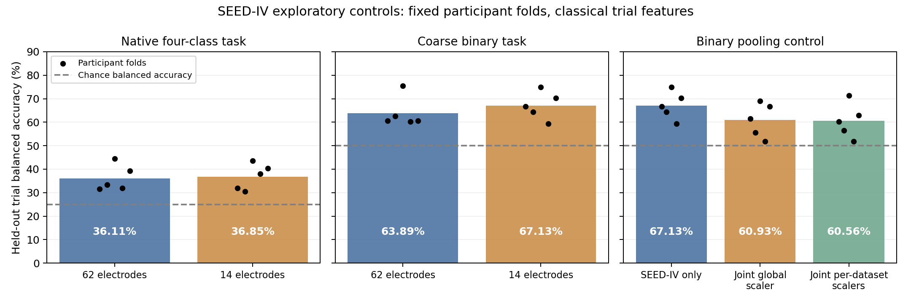

# Exploratory findings before any research-question change

Date: 5 October 2026. **No new research question has been adopted.** The author permits exploratory experiments, wants a strong conference paper, has no fixed deadline, and requires findings and explicit approval before changing the paper question. The current manuscript was preserved byte-for-byte in the repository's `docs/paper_archive/2026-10-05-pre-exploration/`, alongside its existing historical PDF and a hash manifest. Five active image references lack source files; the archived PDF was not regenerated from the source.

The new results identify a useful lead: **adding other datasets can hurt a matched SEED-IV classifier**. They do not establish a new method, explain the mechanism, prove that neural joint training fails, or justify a conference submission yet. The complete concern checklist remains in [publication readiness](GRU-XNet_Publication_Readiness_2026-10-05.md).

**Subsequent follow-up:** the [75-run neural investigation](GRU-XNet_Neural_Transfer_Investigation_2026-10-05.md) now checks source additions, paired initialization, exact dataset/class sampling, target-only scaling, and both compute and available-target-exposure budgets. Its smaller neural pooling differences have participant intervals including zero; ordinary separate heads do not reliably improve on target-only. mdJPT (NeurIPS 2025), missed in the earlier review, is now an essential comparator. The results below remain the initial classical/normalization phase rather than the complete current evidence.

The [completed cross-target extension](GRU-XNet_Multitarget_Transfer_Findings_2026-10-05.md) adds 90 neural runs on DEAP/GAMEEMO. All 165 runs and 285 selected checkpoints are checked; shared-joint versus target-only neural intervals include zero on every target/budget. Linear penalties persist on SEED-IV/GAMEEMO. The current suite passes 32 tests. No pivot is adopted.

## 1. Matched DEAP normalization control

The [exploration plan](../../results/development/exploration_plan_2026-10-05.json) was saved before training. This pair fixes EEGNet-8,2, all 32 named DEAP electrodes, recovered valence labels, 4–40 Hz filtering, four-second windows, seed 42, the same 22/5/5 participant partitions, initialization/sampling policy, fixed Adam 0.001, batch 32, no augmentation, and validation-based selection. Maximum 100 epochs, minimum 25, patience 15. **The sole configured intervention is normalization:** frozen training-electrode statistics versus independent mean/RMS normalization of each window/electrode.

| Normalization | Selected epoch / epochs completed | Training trial BA | Validation trial BA | Test trial BA | Test AUROC | Test participants with constant predictions |
| --- | --- | ---: | ---: | ---: | ---: | ---: |
| Training-channel | 13 / 28 | 66.91% | 56.07% | 46.25% | 0.5007 | 4/5 |
| Per-window | 4 / 25 | 65.66% | 56.86% | 46.67% | 0.4433 | 2/5 |

The same selection/stopping policy produces different realized training budgets and checkpoints. Both final tests cover the same 200 original trials. The observed change is **+0.42 percentage points**, with paired five-participant bootstrap percentile interval **−3.77 to +7.56 points**, obtained by enumerating all 3,125 equally likely draws. This is diagnostic uncertainty from a small, previously inspected development cohort, not a confirmatory statistical test or proof of equivalence. Neither configuration supplies useful generalization. The per-window run took 431 seconds with 117.3 MiB peak CUDA tensor allocation.

The unused training-channel scaler is still fitted/saved by the existing trainer in window mode, but is not applied. This is documented rather than silently changing a verified trainer. Independent reconstruction reproduces the scaler, participant assignments, checkpoint selection, all 3,000 test probabilities and all saved metrics. [Matched comparison](../../results/development/deap_eegnet32_windownorm_seed42/normalization_comparison.json), [test metrics](../../results/development/deap_eegnet32_windownorm_seed42/test_metrics.json), [verification](../../results/development/deap_eegnet32_windownorm_seed42/verification.json).

**Implication:** changing normalization alone did not resolve this raw-EEG control's generalization failure. Fewer constant participant predictions do not imply better discrimination. It remains unjustified to identify the cause of every GRU-XNet failure from this result.

## 2. SEED-IV native-label and electrode controls

All 15 participants, three sessions and 1,080 trials are included. Native labels are neutral/sad/fear/happy. Binary labels merge sad/fear as negative, keep happy positive, and exclude the 270 neutral trials. A seeded participant permutation defines five fixed rotations: **nine training, three validation, three test participants**. Every eligible participant/trial is held out once. Both electrode choices and both tasks use the same folds.

Inputs are classical trial features: natural log bandpowers in half-open ranges 4–8, 8–14, 14–31 and 31–40 Hz, computed with Welch density on non-overlapping four-second windows after the maintained trial filter/resampling, then averaged within each original trial. They retain amplitude information. Training-only StandardScaler and class-balanced logistic regression use `C = [0.01, 0.1, 1, 10]`, selected on validation balanced accuracy; ties pick the smaller C. This is an inexpensive learning diagnostic, **not** a reproduction of published neural or window-level scores. Full trials are used, so it is not a real-time recognition experiment.

| Task | Electrodes | Held-out original trials | Out-of-fold trial balanced accuracy | Chance BA |
| --- | ---: | ---: | ---: | ---: |
| Native four-class | 62 | 1,080 | 36.11% | 25% |
| Native four-class | Common 14 | 1,080 | 36.85% | 25% |
| Coarse binary | 62 | 810 | 63.89% | 50% |
| Coarse binary | Common 14 | 810 | **67.13%** | 50% |

These are different prediction targets with different class counts and trial populations; raw accuracy across tasks is not a controlled comparison. The binary task has a two-to-one negative/positive imbalance, so ordinary majority-class accuracy is 66.67%, while majority balanced accuracy is 50%. Balanced accuracy prevents conflating that majority rule with the reported signal.

There is no demonstrated benefit from 62 electrodes here. These limited classical controls do not prove 14 electrodes are always better, that a native-label neural model cannot help, or that binary mappings across datasets have identical emotional meaning. They do show usable binary SEED-IV structure, so an all-negative neural result cannot by itself establish that the corrected task is unlearnable.

Verification refits **all 80 validation candidates**, reproduces all 20 selected models and **3,780 test prediction rows**, and checks training-only scaler means. Shared-electrode features for **all 810 nonneutral trials exactly match** features independently recomputed from the retained common-14 waveform cache; original source hashes/keys/labels/window counts agree. The native-only/neutral source features are not regenerated by this check. [Results](../../results/development/native_seediv_diagnostic/comparison.json), [folds](../../results/development/native_seediv_diagnostic/folds.json), [reproduction](../../results/development/native_seediv_diagnostic/reproduction.json).

## 3. Matched pooling control

After the native controls, a separate [follow-up plan](../../results/development/joint_seediv_control_plan_2026-10-05.json) was saved before this experiment. The target is the same binary SEED-IV task, common-14 features, folds, validation cohort, classifier family and C grid. Add **only the 22 DEAP training participants / 865 trials and 20 GAMEEMO training participants / 71 trials** from the earlier seed-42 split. Their validation/test participants are excluded from fitting and selection. Each SEED-IV fold contributes 486 training trials; pooled training uses 1,422.

Three conditions compare target-only training, pooled training with one global training-fitted scaler, and pooled training with one training-fitted scaler per dataset. Pooled classifier weights assign equal total weight to each dataset, then each class, then each original trial. Scalers use their declared original training trials only. Every condition selects C using **SEED-IV validation participants only**. No test thresholds, test normalization, or participant calibration is fitted.

| Training condition | Same 810 held-out SEED-IV trials: balanced accuracy | Change from target-only |
| --- | ---: | ---: |
| SEED-IV only | **67.13%** | Reference |
| Joint, global scaler | 60.93% | −6.20 points |
| Joint, per-dataset scalers | 60.56% | −6.57 points |

Paired test-subject bootstrap intervals for these drops are −9.54 to −2.78 and −9.81 to −3.33 points, respectively. They describe variation among the fifteen held-out participants across a **single predefined fold grouping**. Training sets overlap across folds; these intervals do not capture all training/model-selection uncertainty. All **60 validation candidate fits**, all fifteen selected models and **2,430 held-out probabilities** reproduce from retained derived training features. [Results](../../results/development/joint_seediv_diagnostic/comparison.json), [paired comparison](../../results/development/joint_seediv_diagnostic/paired_comparison.json), [reproduction](../../results/development/joint_seediv_diagnostic/reproduction.json).

**Implication:** joint training is not automatically beneficial, even when physical electrodes, labels, source ancestry, class/dataset weights and validation rules are declared. In this controlled classical experiment, adding the other sources lowers target performance. Dataset-specific scaling did not recover the lost performance. More data, recording differences, supervision differences and source weighting change together; the experiment does not isolate label semantics as the cause. It does not establish the effect for GRU-XNet, for the other targets, or for unseen-dataset transfer.

## 4. Research decision and remaining work

**Recommendation: keep alternatives open; do not lock in a new question yet.** The strongest present lead is to measure and address negative transfer from heterogeneous pooling. Before proposing an adoption decision, compare target-only versus pooled training for neural models under matched participant folds, feature/normalization choices, sampling and training budgets, and repeat across targets. First match representations to the working SEED-IV control to distinguish learning failure from pooling failure. Then test whether preserving dataset-native supervision improves over the existing coarse binary objective; the architecture and manuscript claims should follow measured results.

The prior-work barriers remain substantial:

- LibEER already covers seventeen models, six datasets, subject-independent evaluation and controlled preprocessing/setting comparisons. A small generic benchmark is not a sufficient new contribution. Its reproduced cross-subject difficulties also warn against assuming published high scores transfer to a strict new protocol. [Primary revised full text](https://arxiv.org/html/2410.09767v3).
- UBRRL already aligns heterogeneous electrodes through regional representations while reducing distribution gaps. A proposed montage method must improve or meaningfully differ from that approach. Publisher abstract/introduction checked; a full experimental-protocol comparison remains outstanding. [Publisher](https://www.sciencedirect.com/science/article/pii/S1746809426005306).
- CIHL already addresses cross-dataset label inconsistency using coarse/fine hierarchy. Dataset-specific heads or coarse/fine label learning alone must not be claimed as new. Its primary article was identified in the initial review; publisher full text could not be retrieved during this follow-up. [Publisher article](https://www.mdpi.com/2079-9292/15/10/1971).
- REVE supplies pretrained EEG representations designed for heterogeneous electrode arrangements; its authors document the March 2026 code/data release. A resource-bounded pretrained control is worth assessing before claiming progress over modern representations. [Authors' project](https://brain-bzh.github.io/reve/).

| Candidate to investigate | Current support | Requirement before recommending adoption |
| --- | --- | --- |
| Improve pooled learning while retaining each dataset's target semantics | Measured classical negative transfer; differing supervision is documented | Repeat neural/target controls, compare closest label-alignment methods, identify and test a specific new mechanism. Current result does not establish semantics as the cause. |
| Electrode-robust cross-dataset transfer | Heterogeneous layouts are real, but native 62 did not beat common 14 here | Demonstrate a specific gap versus UBRRL/pretrained models using unseen-montage/source-only-validation protocols and channel-removal controls. Present evidence is weak for adopting this direction. |
| Focused provenance/evaluation integrity study | A mirror rating anomaly and historical leakage are documented | Authenticate an independent reference release, quantify label/protocol interventions under matched methods, and demonstrate a contribution beyond existing leakage studies/benchmarks. Current access failure and development controls are insufficient. |

A strong applied conference paper requires a distinctive supported finding or method, complete matched ablations, repeated participant/fold evidence and appropriate external-dataset tests. Historical 95.91% is not confirmatory evidence. First-party DEAP signal authentication remains unresolved. The initial phase passed 24 tests; the subsequent neural-control suite passes **27 tests**. The full neural ablation/LOSO/LODO study, chosen-contribution novelty comparison, final manuscript, missing source figures, compiled paper and submission remain unfinished.

The author is willing to wait for an appropriate venue. A signal-processing or affective-computing conference is a plausible topical fit; the contribution and evidence must determine the venue. Do not claim acceptance readiness or assume future deadlines. Show a concrete proposal and its findings to the author before adopting a changed question, and archive the then-current manuscript again immediately before the approved change.
