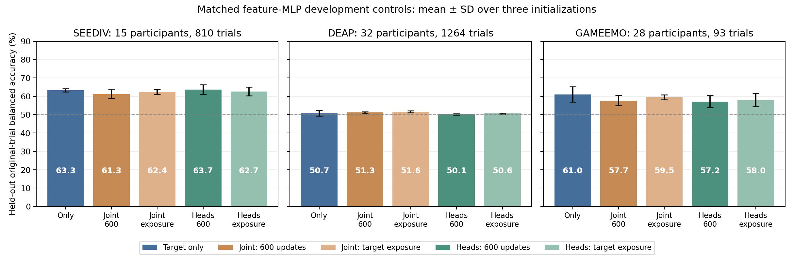

# Pooling controls across all three targets

Date: 5 October 2026. **The completed investigation does not yet support a strong paper around a general neural negative-transfer effect or a separate-head solution.** The linear controls show pooling penalties on SEED-IV and GAMEEMO, while matched feature-MLP penalties are smaller, budget-dependent, and uncertain. DEAP remains near chance under either training choice. These findings narrow the publication options without establishing a new contribution.

The author authorized these exploratory experiments and regular GitHub commits/pushes. **No changed research question has been approved or adopted.** The working manuscript is unchanged and [preserved](../paper_archive/2026-10-05-pre-exploration/README.md). The then-current paper must be archived again immediately before any approved pivot. [Publication readiness](GRU-XNet_Publication_Readiness_2026-10-05.md) remains incomplete.

## What was completed

The initial [SEED-IV investigation](GRU-XNet_Neural_Transfer_Investigation_2026-10-05.md) ran five conditions × five folds × three initializations = 75 neural models, including individual DEAP/GAMEEMO source additions. The [cross-target plan](../../results/development/multitarget_transfer_plan_2026-10-05.json) then declared three conditions × five folds × three initializations on each of DEAP and GAMEEMO = 90 additional models. **All 165 planned neural training runs completed**, with both budget selections where applicable. The extension protocol/code was committed and pushed before either new target was fitted.

Every row below is a **separate target-centered training/validation study**. It is not a table of three datasets evaluated from one common checkpoint. In each study, target-training participants and fixed training participants from the other two datasets enter joint training; target-validation participants alone select checkpoints. It measures the effect of adding sources on new participants of a dataset already represented in training. It does not establish unseen-dataset transfer or the original paper's single jointly selected model objective.

All 2,167 original trials were independently re-extracted from the frozen common-14 waveform cache into the same 56-dimensional mean-window-log-bandpower representation. All 1,746 feature rows used previously matched **exactly**. No fitted statistics enter extraction. [Feature preparation record](../../results/development/cache_common14_trial_features/prepared.json).

| Target | Target cohort / eligible original trials | Target participant folds: train / validation / test | Other datasets' original training participants / trials |
| --- | --- | --- | --- |
| SEED-IV | 15 / 810 | 9 / 3 / 3 | DEAP 22 / 865; GAMEEMO 20 / 71 |
| DEAP | 32 / 1,264 | 18–20 / 6–7 / 6–7 | SEED-IV 11 / 594; GAMEEMO 20 / 71 |
| GAMEEMO | 28 / 93 | 16–18 / 5–6 / 5–6 | SEED-IV 11 / 594; DEAP 22 / 865 |

Each target's seed-42 participant permutation forms five nearly equal groups; rotate the test group and next validation group. Every participant is tested once per initialization. All sessions and trials of a participant remain together. Source validation/test participants are excluded. Seeds 42/43/44 vary network initialization and sampling within the **same** participant grouping.

The frozen MLP trainer, 56 → 64 → 32 → 2, uses LayerNorm/GELU/dropout 0.2, AdamW 0.001, weight decay 0.01, and gradient clipping at 1. Every condition shares the target-training-only scaler, initial backbone/target-head weights, and target draw prefixes. Batches of 60 balance datasets and classes exactly, with replacement. One-head models have 5,986 parameters; three binary heads have 6,118. The target is explicitly mapped to head slot zero, with mappings restored after each sequential study and recorded in its configuration. The earlier trainer/source files remain unchanged.

**Primary budget:** 600 optimizer updates for all conditions, giving target-only 36,000 target presentations and joint training 12,000. **Exposure budget:** continue joint models to 1,800 updates, giving all conditions 36,000 available target presentations. Checkpoints can be selected earlier; equal maximum target exposure does not imply equal selected-checkpoint exposure. Longer runs have more compute and validation candidates. Validation is checked every 25 steps; select by target trial BA, then balanced log loss, before testing. No early stopping, augmentation, test-fitted normalization, or threshold adjustment.

These are full-original-trial feature controls; trial durations differ across datasets. They do not test real-time recognition, the historical CNN–GRU architecture, or native four-class supervision. Separate heads retain coarse binary labels. The model family was fixed before each phase, but the extension was motivated by earlier inspected development results.

## Neural results and uncertainty

Balanced accuracy is calculated on original held-out trials, with a 50% chance baseline. Percentages average three initialization-specific out-of-fold scores, not independent windows.

| Target | Target only | Shared joint, 600 updates | Shared joint, equal available target exposure | Separate heads, 600 updates | Separate heads, equal available target exposure |
| --- | ---: | ---: | ---: | ---: | ---: |
| SEED-IV | **63.30%** | 61.27% | 62.38% | 63.73% | 62.69% |
| DEAP | **50.74%** | 51.25% | 51.62% | 50.12% | 50.64% |
| GAMEEMO | **61.04%** | 57.68% | 59.54% | 57.17% | 58.02% |

The figure's error bars are SD over three initializations. The intervals below use **paired participant bootstrap**, with the same 10,000 participant draws across conditions. For each draw, pool true-negative/false-positive/false-negative/true-positive trial counts within each initialization, compute balanced accuracy, then average paired differences across initializations. This handles unequal trial counts and participants who have only one class without assigning them an artificial balanced accuracy. All 10,000 draws retained both classes for each target; no draws were excluded.

| Target | Shared joint minus target-only: primary difference and participant interval | Same comparison: exposure difference and interval |
| --- | --- | --- |
| SEED-IV | −2.04 points [−4.54, +0.31] | −0.93 [−3.06, +1.20] |
| DEAP | +0.51 [−1.70, +2.94] | +0.88 [−1.40, +3.35] |
| GAMEEMO | −3.36 [−11.21, +4.45] | −1.50 [−10.08, +7.50] |

**Every shared-joint versus target-only neural interval includes zero.** This does not prove no effect or equivalence: GAMEEMO in particular has only 93 labeled original trials and wide uncertainty. Training sets overlap across folds; these intervals condition on selected models and one participant grouping, omitting other training/protocol-selection uncertainty. Multiple comparisons and adaptive development make confirmatory significance claims inappropriate.

Separate heads beat shared joint training on SEED-IV at the primary budget by 2.47 points, but this contracts to 0.31 under the exposure budget. Heads do not reliably beat target-only on any target/budget and are numerically worse than shared joint on DEAP and GAMEEMO. A claim that separate heads solve pooling or prove psychological label mismatch would exceed the evidence.

Training is not universally stuck at a constant predictor. Target-only selected checkpoints average training/validation BA of **85.64% / 70.19% SEED-IV**, **67.86% / 56.42% DEAP**, and **94.77% / 66.09% GAMEEMO**. GAMEEMO's exposure-matched shared joint checkpoints average **98.13% training / 72.21% validation**, while held-out BA remains 59.54%. More fitting and a better validation score do not translate into a demonstrated independent-participant gain. DEAP remains a weak learning/generalization case under this representation.

[All summary metrics, per-seed scores and paired intervals](../../results/development/multitarget_transfer_analysis/comparison.json), [analysis inputs/hashes and limitations](../../results/development/multitarget_transfer_analysis/analysis_provenance.json).

## Linear controls

The same target-centered folds, feature values and frozen target-training scaler compare target-only and shared joint class-balanced logistic regression. Equal dataset/class/trial weights sum to the number of target-training trials, holding loss-to-L2 scaling fixed. Choose C from 0.01/0.1/1/10 using target validation BA, smallest-C tie. These are deterministic fit sets, not three independent initialization replications.

| Target | Target-only BA | Joint BA | Difference: paired participant interval |
| --- | ---: | ---: | --- |
| SEED-IV | **67.13%** | 60.28% | −6.85 points [−9.54, −4.44] |
| DEAP | **49.71%** | 50.15% | +0.44 [−2.84, +4.14] |
| GAMEEMO | **63.11%** | 52.02% | −11.09 [−20.74, −1.50] |

Pooling penalties are clearer for these linear SEED-IV/GAMEEMO controls than for the MLP. A smaller MLP penalty does not make it a better model: target-only linear scores exceed target-only MLP on both targets. The effects depend on the target and model class. The existing source-ablation experiment also finds each other source individually lowers SEED-IV linear BA; it does not identify emotional semantics, recording quality, source statistics or optimization as the cause.

## Reproduction and resource use

| Evidence reproduced | SEED-IV phase | DEAP extension | GAMEEMO extension | Total for this investigation |
| --- | ---: | ---: | ---: | ---: |
| Neural training runs checked | 75 | 45 | 45 | **165** |
| Selected neural checkpoints replayed | 135 | 75 | 75 | **285** |
| Held-out neural probability rows | 21,870 | 18,960 | 1,395 | **42,225** |
| Linear validation candidate refits | 80 | 40 | 40 | **160** |
| Selected linear fits | 20 | 10 | 10 | **40** |
| Held-out linear probability rows | 3,240 | 2,528 | 186 | **5,954** |

Verification refits training-only scalers, checks original participant/trial identity and source exclusions, regenerates exact sampling streams, checks paired initialization, reconstructs validation selection, reloads selected checkpoints, and reproduces all reported neural probabilities/metrics. Linear verification actually refits every declared candidate. It does **not** rerun every neural optimizer update; the full waveform feature re-extraction happened separately during preparation.

Records: [SEED-IV neural](../../results/development/negative_transfer_neural_seediv/verification.json) / [linear](../../results/development/negative_transfer_neural_seediv/linear_verification.json); [DEAP neural](../../results/development/negative_transfer_neural_deap/verification.json) / [linear](../../results/development/negative_transfer_neural_deap/linear_verification.json); [GAMEEMO neural](../../results/development/negative_transfer_neural_gameemo/verification.json) / [linear](../../results/development/negative_transfer_neural_gameemo/linear_verification.json). Original trial-level predictions, configs, folds, and selected metrics are exported alongside them. Checkpoints and raw EEG remain local.

Recorded neural fitting/inference timings total approximately **1,007 seconds (16.8 minutes)** across 165 small models. Largest peak CUDA tensor allocation is **66.87 MiB**, excluding driver/context and other programs. These figures exclude feature preparation, linear fits, verification, code development and literature review. They demonstrate feasibility for these small controls on the RTX 3050 6 GB, not a resource estimate for GRU-XNet or foundation-model training. **32 software tests pass**, including checks for all participant rotations, target routing/sampling restoration after failure, and correct pooled bootstrap treatment of single-class participants.

## Publication decision and further exploration

**Recommendation: do not adopt a general negative-transfer mitigation question yet.** The current controls supply useful, trustworthy development evidence, but no distinctive supported method and no robust neural benefit. They also do not validate the original accuracy claims. Keep the manuscript question unchanged until the author reviews a proposal with stronger evidence and approves it.

| Candidate | Present evidence | Next controlled test / failure criterion | Current decision |
| --- | --- | --- | --- |
| Original compact CNN–GRU joint method | Corrected pipeline exists; previous full/pilot neural runs collapsed; the feature MLP can learn SEED-IV/GAMEEMO | Establish useful validation-only learning for the normalized-STFT model, then run matched GRU/LSTM/attention/CNN ablations. If it still collapses or has no advantage, do not make architectural superiority the contribution. | Retain as a baseline; no demonstrated novel advantage |
| Mitigate heterogeneous pooling | Linear penalties on two targets; smaller uncertain neural penalties; exposure matters; simple heads do not consistently help | Test a specific mechanism across participant groupings and representations, comparing target-only, simple heads, and compatible existing alignment methods. Reject a pivot that only improves one inspected split or depends on reduced target exposure. | Promising problem to study, insufficient contribution evidence |
| Preserve dataset-native supervision | Coarse mappings differ by supervision source; native SEED-IV labels are available | Paired native-four-class versus coarse-binary auxiliary objectives with the same encoder/participants/budget and a common target evaluation. Compare closest hierarchical label-learning work; reject a claim based only on different task difficulties or ordinary multi-head design. | Authorized exploratory candidate, untested neural hypothesis |
| Use pretrained EEG representations | Relevant current models/code are available; no pretrained control has run here | Frozen-feature controls with matched folds, train-only downstream fitting, random-encoder/classical controls, and pretraining-cohort checks. Reject an improvement explainable by changed preprocessing, validation access, or weak baselines. | A useful modern comparator, not a proposed novel contribution |

The [preceding literature comparison](GRU-XNet_Neural_Transfer_Investigation_2026-10-05.md) identifies mdJPT (NeurIPS 2025) as an essential comparator missed in the earlier review. Existing CIHL, UBRRL, LibEER and domain adaptation work also constrain novelty. A specific gap and matched evidence must precede adopting a publication question.

A practical configuration check reinforces the need to adapt rather than copy defaults: mdJPT's current YAML requests two GPUs, 127 workers and 1,024 pairs, defaults to SEED pretraining/SEED-V evaluation, and sets `max_epochs: 3` while the extractor asks for checkpoint epoch 20. These are repository defaults, not a reproduced publication experiment. Its requirements pin torch 2.3.1, while this project uses 2.5.1. No environment changes or mdJPT training were attempted. [Authors' YAML](https://raw.githubusercontent.com/ncclab-sustech/mdJPT_nips2025/main/cfgs_multi/config_multi.yaml), [requirements](https://raw.githubusercontent.com/ncclab-sustech/mdJPT_nips2025/main/requirements.txt).

REVE's documented inference expects 200 Hz EEG and physical electrode positions. Our 128 Hz cache would require a declared resampling/normalization adapter; frozen extraction with a small batch is a feasibility experiment, not a guaranteed 6 GB fit. [Authors' example](https://brain-bzh.github.io/reve/). Its paper states downstream recordings were removed from pretraining; overlap with our exact cohorts/checkpoint still needs checking before an independent-generalization claim. [Primary preprocessing description](https://arxiv.org/html/2510.21585v1).

A July 2026 clinical EEG preprint already stress-tests foundation models with classical/random controls and dataset-identity checks. It concerns clinical tasks, not these emotion datasets, but further limits a generic claim that such controls themselves are new. Publication status beyond the inspected preprint is not asserted. [Primary study](https://arxiv.org/html/2607.24519v1).

Still outstanding: a supported new mechanism or focused empirical contribution, repeated participant groupings, matched raw-EEG/STFT architecture and augmentation controls, complete LOSO and all LODO targets, first-party DEAP signal authentication, full primary-method comparisons, corrected final manuscript/references, missing source figures, compiled PDF, and venue selection/submission. The author has no fixed deadline; these results do not justify rushing a submission.
