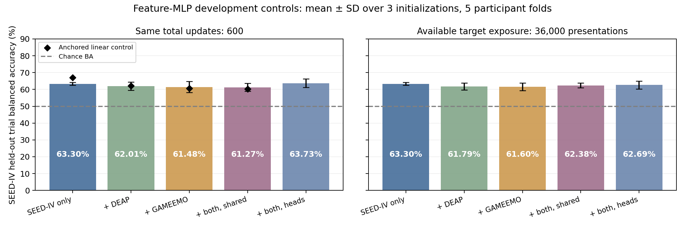

# Neural pooling investigation and publication implications

Date: 5 October 2026. **The matched neural controls do not yet support adopting negative-transfer mitigation as the paper's new contribution.** Joint training has a small average penalty on SEED-IV, but its participant interval includes zero, and ordinary separate heads do not reliably beat target-only training. The stronger classical penalty survives source ablation and an additional regularization control. These results justify checking other targets and representations, not claiming that pooling universally fails or that a new method has been established.

**Subsequent extension completed:** [all-three-target findings](GRU-XNet_Multitarget_Transfer_Findings_2026-10-05.md) add 90 DEAP/GAMEEMO neural runs, bringing this investigation to 165 runs and 285 replayed selected checkpoints. Shared-joint versus target-only neural participant intervals include zero on every target and both budgets. Separate heads do not consistently help. The suite now passes 32 tests. This report retains the first SEED-IV phase and its original 27-test verification milestone.

**No research-question change is approved or adopted.** The author authorized exploration and regular GitHub commits/pushes. The historical manuscript remains untouched and [archived](../paper_archive/2026-10-05-pre-exploration/README.md). Archive the then-current manuscript again immediately before any approved pivot. The [readiness checklist](GRU-XNet_Publication_Readiness_2026-10-05.md) still records incomplete publication work.

## Protocol and controls

The [plan](../../results/development/neural_negative_transfer_plan_2026-10-05.json) was saved before fitting. Use the preceding control's exact 56-dimensional trial features: four mean-window-log-bandpowers at each of the named common 14 electrodes. All 810 eligible SEED-IV original trials are evaluated once per initialization through five fixed participant rotations: nine train, three validation, three test participants. Sources contain only the earlier split's DEAP training participants (22 participants, 865 trials) and GAMEEMO training participants (20 participants, 71 trials). Their validation/test participants are excluded. Labels, features, participant grouping, and source ancestry remain unchanged.

Five conditions, three initializations (42/43/44), and five folds produce **75 neural training runs**. The MLP is 56 → 64 → 32 → 2, with LayerNorm, GELU, and dropout 0.2 in both hidden layers: 5,986 parameters for one head, 6,118 with three binary heads. AdamW uses learning rate 0.001, weight decay 0.01, and gradient clipping at 1; no scheduler, AMP, augmentation, or early stopping. This is a feature-level learning control, **not GRU-XNet or a new architecture**.

Every condition uses exactly the same StandardScaler fitted only to that fold's SEED-IV training trials. No source-specific or held-out normalization is fitted. Batches contain 60 replacement draws, with exact equal dataset quotas and exact equal class quotas within each dataset. Independent source/class streams preserve the same SEED-IV draw prefixes. Backbone and target-head initialization match across paired conditions. Separate heads start as identical copies and route each training trial to its own known dataset head; all labels remain coarse binary.

Two available training budgets separate a compute constraint from dilution of target exposure:

| Budget | Target only | Target + one source | Target + both sources |
| --- | ---: | ---: | ---: |
| Primary: same optimizer updates | 600 updates / 36,000 target draws | 600 / 18,000 | 600 / 12,000 |
| Exposure: same available target draws | Same 600-update run | 1,200 / 36,000 | 1,800 / 36,000 |

Validation selects a checkpoint every 25 updates using target trial balanced accuracy, then balanced log loss. The exposure checkpoint is selected over the entire longer run, including its first 600 updates. **Equal available budgets do not mean selected checkpoints have equal actual exposures.** Longer runs also offer more validation candidates and more total compute. Both test inferences follow final selection of both checkpoints. Previously inspected test cohorts remain development evidence; there is no test-fitted threshold or calibration.

## Neural results

Each number is the mean of three out-of-fold trial balanced accuracies, each covering the same 810 SEED-IV trials. Chance balanced accuracy is 50%. Three initializations assess initialization/sampling variation within one fixed participant grouping; they are not three independent cohort replications.

| Training condition | Primary: 600 updates | Equal available target exposure | Primary change from target only |
| --- | ---: | ---: | ---: |
| SEED-IV only | **63.30%** | Same run | Reference |
| + DEAP, shared head | 62.01% | 61.79% | −1.30 points |
| + GAMEEMO, shared head | 61.48% | 61.60% | −1.82 points |
| + both, shared head | 61.27% | 62.38% | −2.04 points |
| + both, separate binary heads | 63.73% | 62.69% | +0.43 points |

Paired participant bootstrap intervals average within-participant differences over initializations, then resample the fifteen participants 10,000 times. For shared-head joint versus target-only, the primary difference is **−2.04 points, interval −4.54 to +0.31**; the exposure difference is **−0.93, interval −3.06 to +1.20**. For separate heads versus target-only, the primary difference is **+0.43, interval −0.77 to +1.70**; the exposure difference is **−0.62, interval −2.87 to +1.57**. Training sets overlap across folds; these descriptive intervals do not include all training, fold-selection, or adaptive protocol uncertainty, and are not confirmatory significance tests.

Separate heads improve over joint shared-head training at the primary budget by 2.47 points (participant interval +0.80 to +4.35). At the exposure budget the difference falls to 0.31 points (−1.05 to +1.79). This is evidence that the apparent gain depends on the budget; it does not establish a reliable improvement over target-only or a label-semantics mechanism. The primary joint penalties across the three seeds are −5.19, −0.83, and −0.09 points, making their variability visible rather than reporting only the mean.

Selected target-only checkpoints average 85.64% training BA and 70.19% validation BA, versus 63.30% held-out BA. Shared joint checkpoints average 77.61% training / 67.62% validation at the primary budget and 81.64% / 68.64% under the longer budget. This feature MLP learns beyond a constant predictor, but it still trails the 67.13% target-only linear control. These scores do not rescue the earlier normalized-STFT GRU-XNet runs that collapsed to one class.

[All model metrics](../../results/development/negative_transfer_neural_seediv/model_metrics.json), [per-seed summaries](../../results/development/negative_transfer_neural_seediv/neural_comparison.json), [paired intervals](../../results/development/negative_transfer_neural_seediv/paired_comparison.json), [training behavior](../../results/development/negative_transfer_neural_seediv/training_behavior.json), and [held-out trial probabilities](../../results/development/negative_transfer_neural_seediv/trial_predictions.csv) retain all planned conditions.

## Anchored linear source ablation

The additional linear control fixes the target-trained scaler and the total effective training weight to 486, the target's training-trial count, for every condition. This prevents adding source rows from changing the loss-to-L2 scale merely through total sample weight. Equal dataset/class/trial weights, the C grid (0.01/0.1/1/10), target-only validation selection, and five participant folds are declared. This intentionally differs from the preceding global-scaler control in more than one setting; compare conditions within this control rather than attributing score differences between controls to one cause.

| Linear training condition | Out-of-fold target trial BA | Change from target only |
| --- | ---: | ---: |
| SEED-IV only | **67.13%** | Reference |
| + DEAP | 62.13% | −5.00 points |
| + GAMEEMO | 60.65% | −6.48 points |
| + both | 60.28% | −6.85 points |

Both sources individually reduce the linear control's score. This rules out an explanation based solely on one source's inclusion in this configuration, but not alternative mechanisms such as recording shifts, the restricted representation, supervision differences, source weighting, or optimization. It is not evidence that the two datasets are intrinsically harmful.

[Linear candidate and selected results](../../results/development/negative_transfer_neural_seediv/linear_comparison.json), [probabilities](../../results/development/negative_transfer_neural_seediv/linear_trial_predictions.csv).

## Secondary training-only diagnostics and reproduction

A [secondary analysis plan](../../results/development/gradient_conflict_plan_2026-10-05.json) precedes gradient analysis, after the primary neural runs. It uses complete original training trials only, disables dropout, balances each dataset's two classes in its loss, and compares shared-backbone gradients at initialization and selected target-only/joint/separate-head primary checkpoints. No held-out features are used, and no subsequent tuning follows this diagnostic.

Mean target–DEAP gradient cosines are 0.257 at initialization, 0.226 at target-only checkpoints, 0.047 with shared joint training, and 0.146 with separate heads. Individual gradients have mixed signs. Means remain positive; reduced alignment does not prove that gradient conflict caused the held-out penalty or that supervision mismatch explains it. [All 60 records](../../results/development/negative_transfer_neural_seediv/gradient_diagnostics.json), [summary](../../results/development/negative_transfer_neural_seediv/gradient_summary.json).

Independent replay checks frozen scalers, source-participant exclusions, exact source/class sampling streams, paired initializations, validation checkpoint selection, all **135 selected checkpoints**, and **21,870 held-out neural probabilities**. A separate refit reproduces **all 80 linear validation candidates, 20 selected models, and 3,240 probabilities**. It does not rerun every neural optimizer update or re-extract original waveform features. [Neural verification](../../results/development/negative_transfer_neural_seediv/verification.json), [linear verification](../../results/development/negative_transfer_neural_seediv/linear_verification.json).

Neural run timings sum to approximately 502 seconds; peak CUDA tensor allocation is 66.65 MiB on the author's RTX 3050 6 GB. This excludes feature preparation, linear fitting, verification, CUDA context/driver allocation, and other programs. The maintained test suite now has 27 tests, including paired head initialization, correct gradient routing, exact dataset/class quotas, and preserved target sampling prefixes.

## Prior work changes the novelty assessment

The earlier search missed **mdJPT, accepted in the NeurIPS 2025 main conference**. It is now an essential comparator for multi-dataset emotional EEG learning. [Official proceedings](https://papers.neurips.cc/paper_files/paper/2025/hash/f1b8d443042f376aa3654b6c68de6297-Abstract-Conference.html).

Its protocol pretrains on other emotional EEG datasets, aligns covariance and participants, freezes the encoder, and fits a classifier using labeled target participants; it also reports a separate zero-shot setting. Its inputs, labels, supervision, and transfer protocols differ from this direct supervised pooling diagnostic. Its reported gains neither contradict these results nor supply a matched baseline. Generic joint EEG training or ordinary dataset heads are insufficient novelty claims. A proposed method must identify a specific gap and face a compatible comparison. [Primary full text](https://arxiv.org/html/2510.22197v1), [authors' implementation](https://github.com/ncclab-sustech/mdJPT_nips2025).

DAMSDAN is another relevant October 2025 preprint: it weights source domains and aligns class structure, using **unlabeled target inputs during adaptation**. Its evaluated domains are participants/sessions in SEED, SEED-IV, and FACED, so it should not be equated with corpus pooling under our no-held-out-input setting. It reinforces that negative transfer and source weighting already have a research history. Publication status beyond the inspected preprint is not asserted. [Primary paper](https://arxiv.org/html/2510.17475v1).

## Decision and next experiment

The evidence is too narrow and the neural effect too uncertain to recommend adopting a negative-transfer paper now. It also does not support reverting to the historical 95.91% as proof of generalization. The next authorized exploratory step is to repeat matched target-only/shared-joint/separate-head controls on **DEAP and GAMEEMO**, with fixed participant folds and both budgets. That will test whether the finding is target-dependent before proposing a contribution.

A publication proposal should follow measured evidence across targets and a specific gap versus mdJPT, CIHL, UBRRL, and existing domain adaptation work. Preserving native four-class supervision, montage robustness, pretrained representations, and full GRU/BiLSTM/attention controls remain untested neural alternatives. None is an approved pivot. Full repeated-fold/LOSO and LODO evaluations, first-party DEAP signal authentication, final manuscript references/figures, and a compiled submission remain outstanding.
