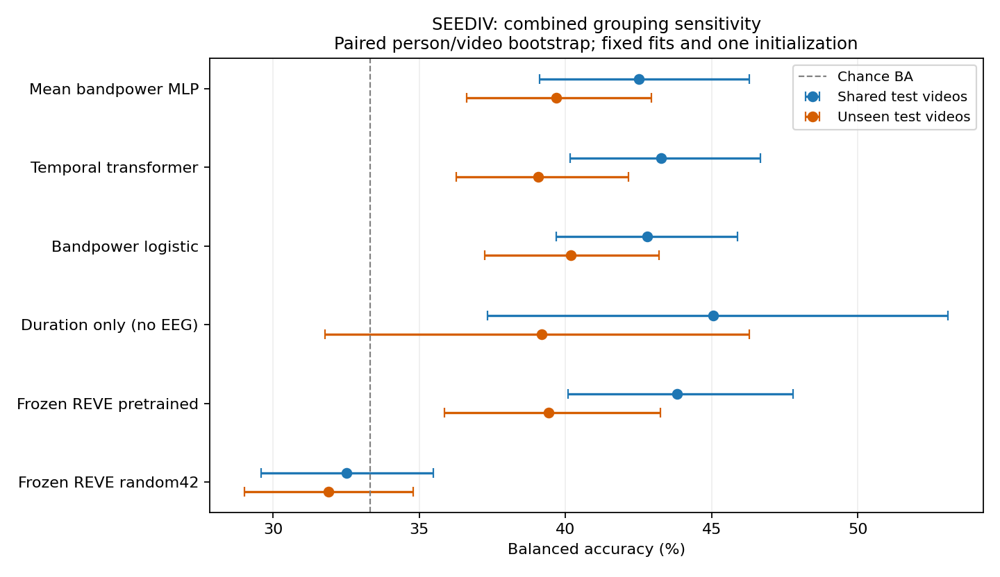
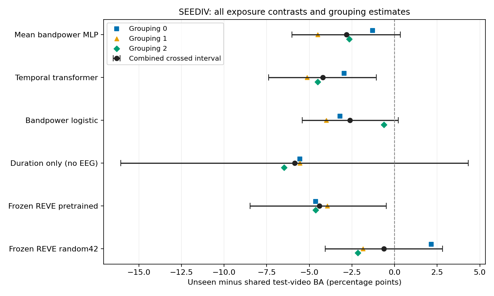
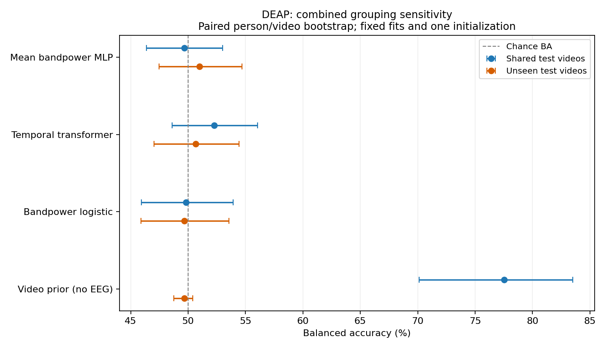
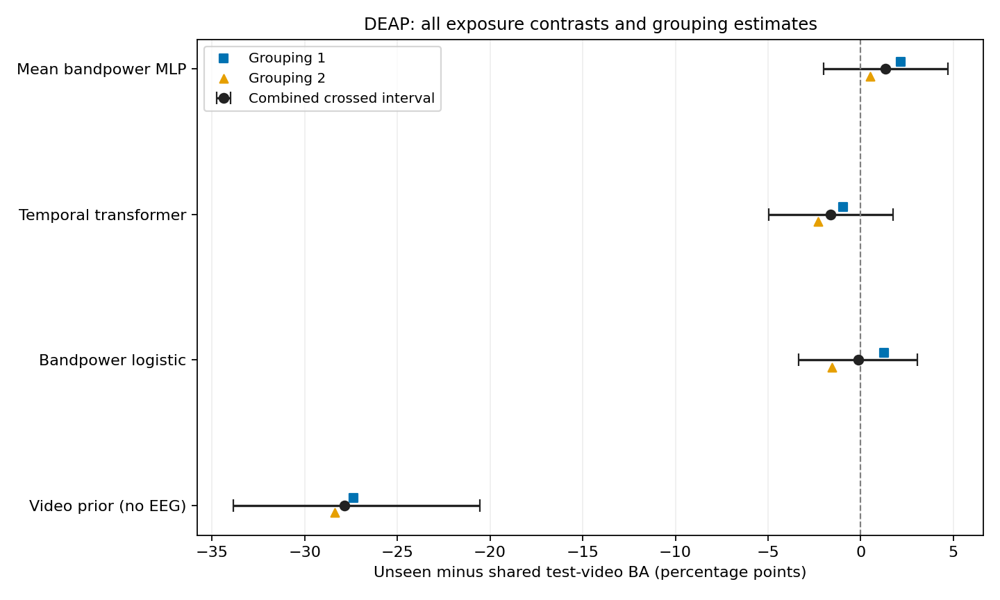

# Repeated participant/video grouping findings — 6 October 2026

**Completed and numerically verified:** 680 new neural fits, 880 selected linear heads, all 3,520 independently refitted linear candidates and 160 training-label-only video-prior diagnostics. New fits produce 46,144 test probability rows; SEED analyses additionally reuse 12,960 previously verified initialization-42 rows. **The manuscript and research question remain unchanged. No pivot is approved.**

**Research assessment:** SEED transformer three-class BA is 43.27% with shared videos and 39.07% with unseen videos, difference -4.20 pp with crossed interval [-7.39,-1.07]. Its exposure differences have the same negative sign in all three groupings. Frozen pretrained REVE also falls 4.40 pp, interval [-8.48,-0.49]. Repeated groupings strengthen the conditional SEED sensitivity finding, while reusing the same people/videos and one initialization.

DEAP transformer binary BA is 52.28% shared and 50.66% unseen, difference -1.61 pp with interval [-4.97,+1.73]. All three DEAP EEG-model exposure intervals include zero; these data allow modest effects and do not prove equivalence. There is no clear unseen-video transformer advantage over the MLP in either corpus. A broad EEG material-collapse or novel transformer-superiority claim is not supported.

The strongest DEAP diagnostic is the source-training-label video prior: 77.54% shared-video BA without EEG, versus 49.67% unseen, difference -27.87 pp with crossed interval [-33.86,-20.53]. This establishes strong contextual predictability of individual labels across people viewing known stimuli. It does not identify the EEG networks' mechanism or prove the provenance of historical/published high scores. All forty DEAP videos contain both rating classes, so video identity is informative without determining each person's answer.

Frozen pretrained-minus-random REVE on unseen SEED materials is +7.53 pp in three-class BA with interval [+2.92,+12.16], a clearer feature-pretraining advantage under these groupings. Its complete private pretraining-corpus exclusion is still uncertified. This is an existing representation control, not a new method. These studies do not test negative transfer caused by jointly training on three corpora.

The [protocol](Repeated_Material_Control_Protocol_2026-10-06.md), source, cache and split records were [pushed before fitting](https://github.com/Overproness/GRU-XNet_EEG_Emotion_Recognition/commit/f5bbdfa). Two additional SEED-IV participant/video groupings and two compatible DEAP groupings were fixed without searching test results. This tests grouping sensitivity on the existing cohorts; repeated partitions are not independent replications with new subjects or videos.

## Combined model results

SEED combines the original grouping at initialization42 with two new groupings at initialization42. The previous [three-initialization result](GRU-XNet_Within_Session_Material_Findings_2026-10-06.md) remains separate. DEAP combines two groupings at initialization42. Combined scores average correctness per observed person/video cell, then class recalls; they do not average unequal fold BAs or choose a preferred grouping.

The shared-video arm estimates generalization to new people viewing known materials; the unseen-video arm estimates transfer to new people and new materials. Both are valid defined settings. A score difference alone cannot diagnose recording/augmentation leakage in historical experiments.

### SEEDIV

| Model | Shared videos: BA | Unseen videos: BA | Difference (pp) | Crossed 95% interval |
|---|---:|---:|---:|---:|
| Mean bandpower MLP | 42.51% | 39.69% | -2.82 | [-6.03, +0.35] |
| Temporal transformer | 43.27% | 39.07% | -4.20 | [-7.39, -1.07] |
| Bandpower logistic | 42.80% | 40.19% | -2.61 | [-5.41, +0.23] |
| Duration only (no EEG) | 45.06% | 39.20% | -5.86 | [-16.06, +4.32] |
| Frozen REVE pretrained | 43.83% | 39.42% | -4.40 | [-8.48, -0.49] |
| Frozen REVE random42 | 32.51% | 31.89% | -0.62 | [-4.07, +2.82] |

SEED's primary target is stimulus-assigned neutral/negative/positive (chance BA 33.33%). The secondary conditional binary task excludes the same 270 neutral trials, retaining 810 trials and the unchanged neutral-mass floor/negative-tie rule. Duration uses full-trial length and no EEG; it is a diagnostic. Frozen REVE features reuse the existing audited adapter, 37 seconds of direct patches inside the normalized 40-second prefix, and one random encoder seed. No encoder is updated; complete target exclusion from its private pretraining corpus remains uncertified.

| Model | Shared: binary BA | Unseen: binary BA |
|---|---:|---:|
| Mean bandpower MLP | 61.11% | 58.61% |
| Temporal transformer | 61.98% | 57.99% |
| Bandpower logistic | 60.09% | 58.21% |
| Duration only (no EEG) | 62.96% | 57.41% |
| Frozen REVE pretrained | 59.60% | 56.17% |
| Frozen REVE random42 | 49.94% | 48.92% |

### DEAP

| Model | Shared videos: BA | Unseen videos: BA | Difference (pp) | Crossed 95% interval |
|---|---:|---:|---:|---:|
| Mean bandpower MLP | 49.66% | 51.00% | +1.34 | [-2.02, +4.69] |
| Temporal transformer | 52.28% | 50.66% | -1.61 | [-4.97, +1.73] |
| Bandpower logistic | 49.82% | 49.67% | -0.14 | [-3.35, +3.04] |
| Video prior (no EEG) | 77.54% | 49.67% | -27.87 | [-33.86, -20.53] |

DEAP uses individual self-reported valence, chance BA 50%, 1,264 retained trials, 32 people and 40 Experiment_id videos. 40 of40 videos have both positive and negative ratings across retained people; observed people per video range from 30 to 32. [Complete label counts](../../results/development/repeated_material_deap/label_heterogeneity.json). Each fit has 24/4/4 disjoint training/validation/test people. After participant/class matching, trial counts range from 328–360 training, 30–32 validation and 30–32 test. Every split contains both classes. Exact training participant/class counts and test/validation trials match between arms; all test-video keys remain represented in exposed training after matching. No validation video enters training. Each trial is tested once per grouping.

Video-prior predictions use only selected training labels associated with each video, Laplace-one smoothing and a global training-rate fallback for unseen videos. They use no EEG and no test-based selection. Both neural backbones have actual two-class heads (18,992 MLP versus 19,042 transformer parameters). These DEAP results do not independently authenticate first-party signals, reproduce a published Conformer or test a frozen DEAP foundation model.

## Every grouping and paired contrast

Each table includes every declared contrast. Grouping0 is prior SEED initialization42, groupings1/2 are new. Repeats reuse all people/materials. Combined intervals do not treat repeats as new independent samples. Resample people and videos with paired fixed weights, using observed-cell class numerators and denominators. DEAP's sixteen excluded midpoint cells remain absent, and videos are not stratified by a single class. SEED retains session/native-emotion material strata. Intervals are unadjusted exploratory percentiles, conditional on fixed models/partitions/cohorts; no causal effect or equivalence inference is established.

### All SEEDIV contrasts

| Group | Contrast (A minus B) | Task | Difference (pp) | Person-only interval | Person/video interval |
|---|---|---|---:|---:|---:|
| combined | Mean bandpower MLP: unseen minus shared | coarse3 | -2.82 | [-4.36, -1.23] | [-6.03, +0.35] |
| combined | Temporal transformer: unseen minus shared | coarse3 | -4.20 | [-5.76, -2.63] | [-7.39, -1.07] |
| combined | Bandpower logistic: unseen minus shared | coarse3 | -2.61 | [-3.68, -1.52] | [-5.41, +0.23] |
| combined | Duration only (no EEG): unseen minus shared | coarse3 | -5.86 | [-5.86, -5.86] | [-16.06, +4.32] |
| combined | Frozen REVE pretrained: unseen minus shared | coarse3 | -4.40 | [-6.17, -2.70] | [-8.48, -0.49] |
| combined | Frozen REVE random42: unseen minus shared | coarse3 | -0.62 | [-2.14, +1.01] | [-4.07, +2.82] |
| combined | Temporal transformer minus Mean bandpower MLP (exposed) | coarse3 | +0.76 | [-0.80, +2.33] | [-2.08, +3.62] |
| combined | Temporal transformer minus Mean bandpower MLP (unexposed) | coarse3 | -0.62 | [-2.61, +1.36] | [-3.46, +2.35] |
| combined | Frozen REVE pretrained minus Frozen REVE random42 (exposed) | coarse3 | +11.32 | [+8.04, +14.71] | [+6.81, +15.97] |
| combined | Frozen REVE pretrained minus Frozen REVE random42 (unexposed) | coarse3 | +7.53 | [+4.32, +10.91] | [+2.92, +12.16] |
| combined | Mean bandpower MLP: unseen minus shared | binary | -2.50 | [-4.23, -0.93] | [-6.39, +1.20] |
| combined | Temporal transformer: unseen minus shared | binary | -3.98 | [-5.74, -2.19] | [-7.59, -0.65] |
| combined | Bandpower logistic: unseen minus shared | binary | -1.88 | [-3.21, -0.37] | [-5.03, +1.45] |
| combined | Duration only (no EEG): unseen minus shared | binary | -5.56 | [-5.56, -5.56] | [-16.67, +5.09] |
| combined | Frozen REVE pretrained: unseen minus shared | binary | -3.43 | [-5.83, -1.23] | [-8.15, +1.20] |
| combined | Frozen REVE random42: unseen minus shared | binary | -1.02 | [-3.46, +1.88] | [-5.28, +3.95] |
| combined | Temporal transformer minus Mean bandpower MLP (exposed) | binary | +0.86 | [-0.31, +2.28] | [-1.91, +3.86] |
| combined | Temporal transformer minus Mean bandpower MLP (unexposed) | binary | -0.62 | [-2.72, +1.42] | [-4.14, +2.96] |
| combined | Frozen REVE pretrained minus Frozen REVE random42 (exposed) | binary | +9.66 | [+7.28, +12.04] | [+5.31, +14.26] |
| combined | Frozen REVE pretrained minus Frozen REVE random42 (unexposed) | binary | +7.25 | [+4.48, +10.06] | [+1.79, +12.53] |
| 0 | Mean bandpower MLP: unseen minus shared | coarse3 | -1.30 | [-3.77, +1.67] | [-6.30, +4.26] |
| 0 | Temporal transformer: unseen minus shared | coarse3 | -2.96 | [-5.68, -0.68] | [-8.40, +2.22] |
| 0 | Bandpower logistic: unseen minus shared | coarse3 | -3.21 | [-5.56, -1.11] | [-7.72, +1.17] |
| 0 | Duration only (no EEG): unseen minus shared | coarse3 | -5.56 | [-5.56, -5.56] | [-21.30, +10.19] |
| 0 | Frozen REVE pretrained: unseen minus shared | coarse3 | -4.63 | [-7.65, -1.67] | [-10.31, +1.11] |
| 0 | Frozen REVE random42: unseen minus shared | coarse3 | +2.16 | [-0.74, +4.94] | [-3.70, +7.84] |
| 0 | Temporal transformer minus Mean bandpower MLP (exposed) | coarse3 | +0.43 | [-2.28, +2.90] | [-4.32, +5.31] |
| 0 | Temporal transformer minus Mean bandpower MLP (unexposed) | coarse3 | -1.23 | [-4.26, +1.60] | [-6.17, +3.77] |
| 0 | Frozen REVE pretrained minus Frozen REVE random42 (exposed) | coarse3 | +13.15 | [+8.83, +17.84] | [+6.73, +19.75] |
| 0 | Frozen REVE pretrained minus Frozen REVE random42 (unexposed) | coarse3 | +6.36 | [+2.28, +11.05] | [+0.19, +12.90] |
| 0 | Mean bandpower MLP: unseen minus shared | binary | -1.39 | [-4.54, +1.94] | [-7.96, +5.37] |
| 0 | Temporal transformer: unseen minus shared | binary | -0.56 | [-3.24, +2.13] | [-6.30, +5.00] |
| 0 | Bandpower logistic: unseen minus shared | binary | -1.20 | [-3.52, +1.20] | [-6.48, +4.44] |
| 0 | Duration only (no EEG): unseen minus shared | binary | -1.39 | [-1.39, -1.39] | [-18.06, +15.28] |
| 0 | Frozen REVE pretrained: unseen minus shared | binary | -2.78 | [-6.39, +0.83] | [-10.28, +4.81] |
| 0 | Frozen REVE random42: unseen minus shared | binary | +2.96 | [-0.28, +6.30] | [-3.98, +9.81] |
| 0 | Temporal transformer minus Mean bandpower MLP (exposed) | binary | -1.85 | [-4.44, +1.20] | [-7.69, +4.17] |
| 0 | Temporal transformer minus Mean bandpower MLP (unexposed) | binary | -1.02 | [-4.44, +2.69] | [-6.85, +5.00] |
| 0 | Frozen REVE pretrained minus Frozen REVE random42 (exposed) | binary | +12.13 | [+8.24, +15.93] | [+5.00, +19.26] |
| 0 | Frozen REVE pretrained minus Frozen REVE random42 (unexposed) | binary | +6.39 | [+2.87, +9.91] | [-0.74, +13.52] |
| 1 | Mean bandpower MLP: unseen minus shared | coarse3 | -4.51 | [-7.10, -1.98] | [-9.51, +0.25] |
| 1 | Temporal transformer: unseen minus shared | coarse3 | -5.12 | [-7.84, -2.41] | [-10.56, +0.49] |
| 1 | Bandpower logistic: unseen minus shared | coarse3 | -4.01 | [-6.79, -1.54] | [-9.32, +1.48] |
| 1 | Duration only (no EEG): unseen minus shared | coarse3 | -5.56 | [-5.56, -5.56] | [-22.22, +12.04] |
| 1 | Frozen REVE pretrained: unseen minus shared | coarse3 | -3.95 | [-6.48, -1.30] | [-9.26, +1.67] |
| 1 | Frozen REVE random42: unseen minus shared | coarse3 | -1.85 | [-4.63, +1.11] | [-7.66, +4.26] |
| 1 | Temporal transformer minus Mean bandpower MLP (exposed) | coarse3 | +0.25 | [-2.41, +2.84] | [-4.51, +4.88] |
| 1 | Temporal transformer minus Mean bandpower MLP (unexposed) | coarse3 | -0.37 | [-3.46, +2.41] | [-5.74, +4.63] |
| 1 | Frozen REVE pretrained minus Frozen REVE random42 (exposed) | coarse3 | +8.64 | [+4.88, +12.78] | [+3.02, +14.44] |
| 1 | Frozen REVE pretrained minus Frozen REVE random42 (unexposed) | coarse3 | +6.54 | [+2.22, +10.00] | [+0.25, +12.41] |
| 1 | Mean bandpower MLP: unseen minus shared | binary | -1.85 | [-4.63, +1.02] | [-7.59, +3.98] |
| 1 | Temporal transformer: unseen minus shared | binary | -7.04 | [-10.00, -4.07] | [-12.41, -1.85] |
| 1 | Bandpower logistic: unseen minus shared | binary | -4.07 | [-8.33, +0.00] | [-10.56, +2.50] |
| 1 | Duration only (no EEG): unseen minus shared | binary | -2.78 | [-2.78, -2.78] | [-20.83, +16.67] |
| 1 | Frozen REVE pretrained: unseen minus shared | binary | -3.80 | [-6.39, -1.39] | [-10.09, +2.41] |
| 1 | Frozen REVE random42: unseen minus shared | binary | -4.07 | [-8.52, +0.83] | [-11.67, +3.80] |
| 1 | Temporal transformer minus Mean bandpower MLP (exposed) | binary | +2.31 | [+1.11, +3.52] | [-2.22, +6.85] |
| 1 | Temporal transformer minus Mean bandpower MLP (unexposed) | binary | -2.87 | [-6.39, +0.65] | [-9.81, +3.80] |
| 1 | Frozen REVE pretrained minus Frozen REVE random42 (exposed) | binary | +7.31 | [+3.33, +11.02] | [+1.30, +13.24] |
| 1 | Frozen REVE pretrained minus Frozen REVE random42 (unexposed) | binary | +7.59 | [+3.06, +11.76] | [+0.00, +14.26] |
| 2 | Mean bandpower MLP: unseen minus shared | coarse3 | -2.65 | [-5.12, -0.25] | [-7.96, +2.47] |
| 2 | Temporal transformer: unseen minus shared | coarse3 | -4.51 | [-7.47, -1.73] | [-9.81, +0.56] |
| 2 | Bandpower logistic: unseen minus shared | coarse3 | -0.62 | [-2.59, +1.42] | [-5.43, +3.95] |
| 2 | Duration only (no EEG): unseen minus shared | coarse3 | -6.48 | [-6.48, -6.48] | [-20.37, +7.41] |
| 2 | Frozen REVE pretrained: unseen minus shared | coarse3 | -4.63 | [-7.90, -1.42] | [-10.86, +1.67] |
| 2 | Frozen REVE random42: unseen minus shared | coarse3 | -2.16 | [-5.74, +1.60] | [-8.15, +4.20] |
| 2 | Temporal transformer minus Mean bandpower MLP (exposed) | coarse3 | +1.60 | [-1.42, +4.75] | [-3.46, +6.60] |
| 2 | Temporal transformer minus Mean bandpower MLP (unexposed) | coarse3 | -0.25 | [-3.64, +3.21] | [-5.37, +4.81] |
| 2 | Frozen REVE pretrained minus Frozen REVE random42 (exposed) | coarse3 | +12.16 | [+8.15, +16.30] | [+5.68, +18.70] |
| 2 | Frozen REVE pretrained minus Frozen REVE random42 (unexposed) | coarse3 | +9.69 | [+5.80, +13.77] | [+3.52, +16.11] |
| 2 | Mean bandpower MLP: unseen minus shared | binary | -4.26 | [-7.04, -1.57] | [-10.56, +1.57] |
| 2 | Temporal transformer: unseen minus shared | binary | -4.35 | [-7.13, -1.67] | [-10.28, +1.48] |
| 2 | Bandpower logistic: unseen minus shared | binary | -0.37 | [-2.50, +1.76] | [-5.74, +5.19] |
| 2 | Duration only (no EEG): unseen minus shared | binary | -12.50 | [-12.50, -12.50] | [-29.17, +4.17] |
| 2 | Frozen REVE pretrained: unseen minus shared | binary | -3.70 | [-7.41, -0.37] | [-10.74, +3.24] |
| 2 | Frozen REVE random42: unseen minus shared | binary | -1.94 | [-5.28, +1.30] | [-8.24, +4.81] |
| 2 | Temporal transformer minus Mean bandpower MLP (exposed) | binary | +2.13 | [+0.09, +4.26] | [-2.59, +6.57] |
| 2 | Temporal transformer minus Mean bandpower MLP (unexposed) | binary | +2.04 | [-1.57, +5.37] | [-3.89, +8.06] |
| 2 | Frozen REVE pretrained minus Frozen REVE random42 (exposed) | binary | +9.54 | [+6.57, +12.50] | [+3.33, +15.93] |
| 2 | Frozen REVE pretrained minus Frozen REVE random42 (unexposed) | binary | +7.78 | [+4.44, +10.83] | [+0.83, +14.35] |

### All DEAP contrasts

| Group | Contrast (A minus B) | Task | Difference (pp) | Person-only interval | Person/video interval |
|---|---|---|---:|---:|---:|
| combined | Mean bandpower MLP: unseen minus shared | binary | +1.34 | [-0.44, +3.04] | [-2.02, +4.69] |
| combined | Temporal transformer: unseen minus shared | binary | -1.61 | [-3.51, +0.19] | [-4.97, +1.73] |
| combined | Bandpower logistic: unseen minus shared | binary | -0.14 | [-1.79, +1.51] | [-3.35, +3.04] |
| combined | Video prior (no EEG): unseen minus shared | binary | -27.87 | [-31.15, -24.22] | [-33.86, -20.53] |
| combined | Temporal transformer minus Mean bandpower MLP (exposed) | binary | +2.61 | [+0.23, +4.91] | [-1.08, +6.32] |
| combined | Temporal transformer minus Mean bandpower MLP (unexposed) | binary | -0.34 | [-2.35, +1.63] | [-4.12, +3.44] |
| 1 | Mean bandpower MLP: unseen minus shared | binary | +2.15 | [-0.66, +5.01] | [-2.82, +7.08] |
| 1 | Temporal transformer: unseen minus shared | binary | -0.94 | [-3.78, +1.75] | [-6.25, +4.26] |
| 1 | Bandpower logistic: unseen minus shared | binary | +1.25 | [-0.84, +3.33] | [-3.57, +6.36] |
| 1 | Video prior (no EEG): unseen minus shared | binary | -27.36 | [-30.74, -23.62] | [-33.49, -19.87] |
| 1 | Temporal transformer minus Mean bandpower MLP (exposed) | binary | +2.78 | [-0.55, +6.07] | [-2.25, +7.91] |
| 1 | Temporal transformer minus Mean bandpower MLP (unexposed) | binary | -0.31 | [-3.20, +2.17] | [-5.56, +5.06] |
| 2 | Mean bandpower MLP: unseen minus shared | binary | +0.53 | [-1.72, +2.79] | [-3.96, +5.26] |
| 2 | Temporal transformer: unseen minus shared | binary | -2.29 | [-4.82, +0.16] | [-7.01, +2.31] |
| 2 | Bandpower logistic: unseen minus shared | binary | -1.54 | [-4.25, +1.14] | [-6.08, +2.79] |
| 2 | Video prior (no EEG): unseen minus shared | binary | -28.37 | [-31.64, -24.67] | [-34.27, -20.93] |
| 2 | Temporal transformer minus Mean bandpower MLP (exposed) | binary | +2.45 | [-0.30, +5.34] | [-2.53, +7.44] |
| 2 | Temporal transformer minus Mean bandpower MLP (unexposed) | binary | -0.37 | [-3.19, +2.55] | [-5.38, +4.83] |

## Selection, hardware and verification

| Corpus | Model | Arm | Median selected update | Mean train BA | Mean validation BA | Mean test-fold BA (diagnostic) |
|---|---|---|---:|---:|---:|---:|
| DEAP | Mean bandpower MLP | exposed | 175 | 72.75% | 59.42% | 50.68% |
| DEAP | Mean bandpower MLP | unexposed | 150 | 73.07% | 59.66% | 51.64% |
| DEAP | Temporal transformer | exposed | 200 | 76.58% | 60.93% | 52.54% |
| DEAP | Temporal transformer | unexposed | 175 | 75.75% | 61.20% | 50.95% |
| SEEDIV | Mean bandpower MLP | exposed | 125 | 89.42% | 50.93% | 42.53% |
| SEEDIV | Mean bandpower MLP | unexposed | 112 | 88.76% | 51.17% | 38.95% |
| SEEDIV | Temporal transformer | exposed | 100 | 82.74% | 50.99% | 43.46% |
| SEEDIV | Temporal transformer | unexposed | 75 | 80.85% | 51.11% | 38.64% |

The 680 new fits total **3745.9 seconds**, with peak **71.96 MiB allocated CUDA tensors** on the RTX 3050. This excludes CUDA context/display/driver allocations, preprocessing, classical fitting and earlier frozen extraction. Every fit retains 600 updates and 24 validation evaluations; validation-only selection is replayed. The small held-out populations make selection noisy, especially SEED's twelve validation trials. The displayed mean test-fold BA is a training diagnostic; primary DEAP estimates aggregate original trial predictions.

All 53 scientific-control tests passed before fitting. Independent numerical checks replay all 680 selected checkpoint train/validation/test predictions and scalers, reproduce initial weights and canonical batch signatures across paired arms, check exact split records and once-per-trial coverage, and independently refit every linear candidate and selected coefficient. The complete bootstrap analysis is recomputed exactly. DEAP preparation checked 32 raw-file hashes, spreadsheet metadata, 1,264 waveform hashes and ordered windows; continuous-rating CSV comparisons allow 1e-12 floating-point parsing differences while binary labels are exact. No label mapping was changed.

The additional [DEAP source replay](../../results/development/cache_temporal_deap/raw_reproduction.json) reread all32 downloaded participant files and the corrected spreadsheet loader. It exactly regenerated all1,264 retained full filtered waveforms and first40-second sequence arrays, while checking all16 excluded midpoint trials. Maximum array difference was zero. This source replay occurred during SEED fitting and before DEAP fitting; it made no data or parameter changes and is not first-party authentication.

SEEDIV maximum selected-neural probability replay error: 2.98e-08; maximum linear error: 1.11e-16; maximum coefficient-refit error: 0. [Verification](../../results/development/repeated_material_seediv/verification.json), [analysis replay](../../results/development/repeated_material_seediv/analysis_verification.json), [all group scores](../../results/development/repeated_material_seediv/all_groups.csv), [every test cell](../../results/development/repeated_material_seediv/all_cells.csv), [training diagnostics](../../results/development/repeated_material_seediv/training_diagnostics.csv) and [full comparison](../../results/development/repeated_material_seediv/comparison.json) retain complete evidence.

DEAP maximum selected-neural probability replay error: 2.98e-08; maximum linear error: 1.11e-16; maximum coefficient-refit error: 0. [Verification](../../results/development/repeated_material_deap/verification.json), [analysis replay](../../results/development/repeated_material_deap/analysis_verification.json), [all group scores](../../results/development/repeated_material_deap/all_groups.csv), [every test cell](../../results/development/repeated_material_deap/all_cells.csv), [training diagnostics](../../results/development/repeated_material_deap/training_diagnostics.csv) and [full comparison](../../results/development/repeated_material_deap/comparison.json) retain complete evidence.

## Research decision limits

Exposure changes training video content, difficulty and order along with identity. Repeated groupings quantify sensitivity within already inspected cohorts; they do not increase the number of people or independent video stimuli. One new optimizer initialization does not independently establish stability across optimization seeds. SEED stimulus-assigned classes and DEAP individual ratings have different semantics. Neither corpus result tests joint three-dataset training or leave-one-dataset-out generalization. Original SEED media hashes are unavailable, first-party DEAP signal authentication remains outstanding, and REVE's complete pretraining overlap is uncertified.

The prior-work audit already found subject/material separation precedents. Holding out clips or adding a transformer alone is not a novel method. A defensible new paper would still need a clearly justified contribution, matched full GRU-XNet architectural baselines/ablations, broader generalization validation and an accurate rebuilt manuscript. Use the entire evidence to propose a direction; do not adopt a changed question automatically. The [readiness checklist](GRU-XNet_Publication_Readiness_2026-10-05.md) tracks these unfinished items. Show findings and get author approval before a pivot, then archive the then-current manuscript immediately before changing it.

**Next experimental priority:** carry the original GRU-XNet and matched CBSAtt/BiLSTM control through the same source-only participant/video protocols, with a declared observation/normalization and matched training/selection budget. Add the contextual prior as a diagnostic. Test whether EEG adds predictive information beyond that prior by comparing EEG-plus-context with context alone; derive training-row priors by participant cross-fitting so a row's own label cannot enter its contextual feature, and derive held-out priors solely from training people. Declare this before fitting and retain both known/unseen-material settings. These are proposed diagnostics, not completed experiments or an adopted research question. Confirm comparable prior-work coverage before presenting a new contribution.
