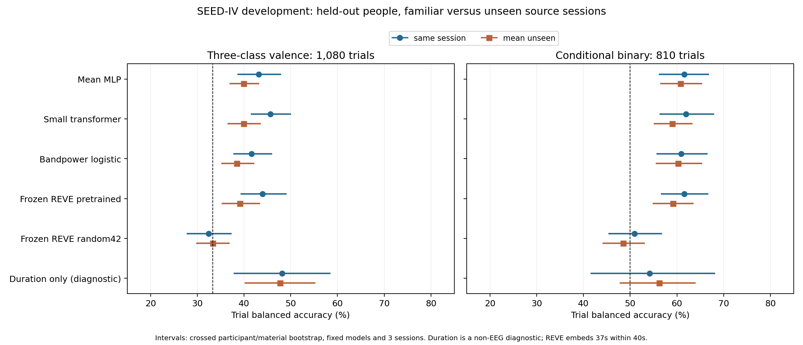
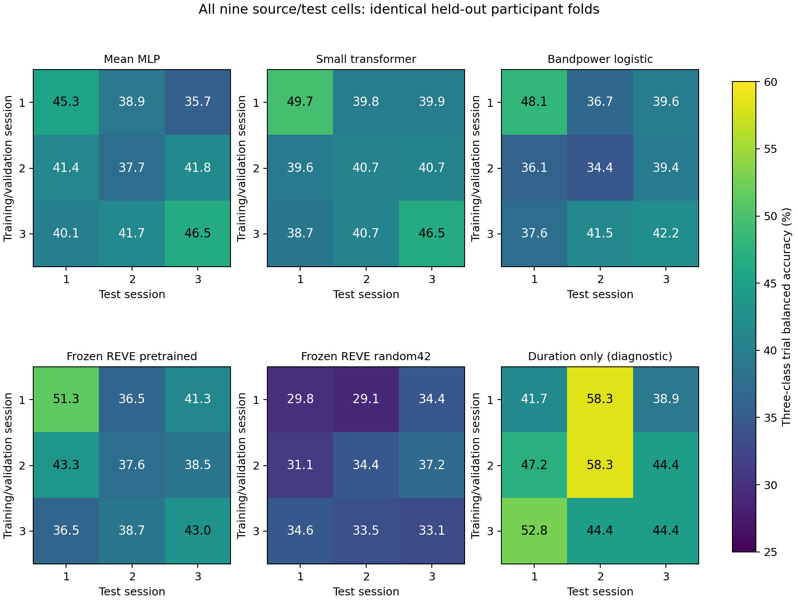

# Participant/session transfer and frozen pretraining findings

Date: 6 October 2026. **90 neural fits, 70 selected linear models and 34,560 test probability rows are complete and verified. No research question has been changed. The paper remains unready for submission.**

The small transformer's three-class balanced accuracy is **45.64% on familiar source sessions and 39.90% on unseen source sessions**. The paired change is **-5.74 percentage points**, with crossed participant/material interval **[-9.51, -2.21]**. Its point advantage over the MLP disappears on unseen sessions. Even its familiar-session advantage has crossed interval **[-0.80, +5.97]**, which includes zero. Holding people out alone does not guarantee robustness to a new recording session and its stimulus material.

Frozen pretrained REVE reaches **39.14% unseen-session three-class BA**, versus **33.33% for the same frozen architecture with random seed42 weights**. The direct weight comparison is **+5.80 pp**, crossed interval **[+0.62, +11.08]**. The downloaded weights help under this adapter, subject to one random encoder initialization and incomplete independent checkpoint-corpus authentication. This does not establish a new pretraining method, superiority over the small models or a solution to session transfer. These are exploratory unadjusted intervals conditional on fixed folds, models and three observed sessions.

## Controlled access and complete results

All arms use the same 1,080 SEED-IV original trials, 15 people, three sessions and 14 named physical electrodes. Coarse targets are neutral / negative (sadness+fear) / positive. Five participant rotations have nine training, three validation and three test people; all sessions of held-out people are excluded from fitting and selection. Each source-session model trains on 216 trials and validates on 72 trials **from that source session alone**. Select once, then evaluate the same three held-out people's 72 trials in every session. No other-session inputs or labels enter scaling, fitting or checkpoint selection.

Same-session results use the nine-cell matrix's diagonal. Two cyclic unseen-source assignments each cover every target trial once; average their scores, not their probabilities. Target trials are identical in the comparisons. Three seeds initialize each small neural arm; their results are averaged, not counted as additional people. The [session protocol](Session_Stimulus_Control_Protocol_2026-10-06.md) was declared and pushed before its 90 fits. Its matched available exposure, class sampling and optimizer budget are unchanged from the preceding models. Source-specific checkpoint choices can differ.

| Model | Same-session 3-class BA | Unseen-session 3-class BA | Same-session binary BA | Unseen-session binary BA |
| --- | ---: | ---: | ---: | ---: |
| Mean MLP | 43.15% | 39.94% | 61.60% | 60.76% |
| Small transformer | 45.64% | 39.90% | 61.98% | 59.01% |
| Bandpower logistic | 41.60% | 38.49% | 60.93% | 60.28% |
| Frozen REVE pretrained | 43.95% | 39.14% | 61.57% | 59.12% |
| Frozen REVE random42 | 32.47% | 33.33% | 50.93% | 48.52% |
| Duration only (diagnostic) | 48.15% | 47.69% | 54.17% | 56.25% |

Chance BA is 33.33% for three classes and 50% for binary. Conditional binary excludes the same 270 neutral trials and conditions negative/positive probabilities. The duration-only arm receives **full original trial length and no EEG**; it is a diagnostic and must not enter EEG-model superiority claims. Its 48.15% familiar-session and 47.69% unseen-session three-class scores show material-duration/label association within this corpus, not proof that the fixed-prefix EEG models use trial length.

With all three sessions available to training/validation people, frozen REVE gives **43.09% three-class / 60.56% binary**, versus random **34.26% / 50.09%**. Mixed-session fitting supplies three times as many training trials and includes the test session's material among other participants. It is a different access protocol, not an unseen-session result. The earlier 120-run mixed-session bandpower factorial is also a different fitting protocol and should not be used as an exact training-size comparison.

## Participant and material uncertainty

The initial participant-only analysis holds all 72 corpus materials fixed. Its three-class transformer-minus-MLP familiar-session interval is +0.04 to +5.21 pp. The crossed interval is [-0.80, +5.97]; that changes the interpretation. For duration, identical participant responses to fixed-length clips can make participant-only intervals degenerate. That does not mean performance on new clips is certain.

The [sensitivity declaration](../../results/development/session_material_sensitivity_plan_2026-10-06.json) was added **after initial session outcomes were inspected and before REVE head outcomes**. It is an explicitly exploratory addendum. Resample 15 people and independently six clip-position keys in each of twelve session/native-emotion strata, weighting every participant/material cell by the product. Average seeds and source directions first. The same 10,000 draws are paired across arms; proportions and target trials are fixed. Training folds and checkpoints are not refit. The published design supports (session,trial-position) material keys; original stimulus-file hashes are unavailable.

| Model A / protocol minus model B / protocol | Task | Difference (pp) | Crossed 95% interval (pp) |
| --- | --- | ---: | ---: |
| Mean MLP / mean_unseen minus Mean MLP / same_session | coarse3 | -3.21 | [-6.78, +0.45] |
| Small transformer / mean_unseen minus Small transformer / same_session | coarse3 | -5.74 | [-9.51, -2.21] |
| Bandpower logistic / mean_unseen minus Bandpower logistic / same_session | coarse3 | -3.12 | [-7.28, +0.83] |
| Duration only (diagnostic) / mean_unseen minus Duration only (diagnostic) / same_session | coarse3 | -0.46 | [-12.96, +12.50] |
| Frozen REVE pretrained / mean_unseen minus Frozen REVE pretrained / same_session | coarse3 | -4.81 | [-9.41, -0.22] |
| Frozen REVE random42 / mean_unseen minus Frozen REVE random42 / same_session | coarse3 | +0.86 | [-5.37, +6.73] |
| Small transformer / same_session minus Mean MLP / same_session | coarse3 | +2.49 | [-0.80, +5.97] |
| Small transformer / mean_unseen minus Mean MLP / mean_unseen | coarse3 | -0.04 | [-2.33, +2.22] |
| Frozen REVE pretrained / mixed_sessions minus Frozen REVE random42 / mixed_sessions | coarse3 | +8.83 | [+1.67, +16.36] |
| Frozen REVE pretrained / same_session minus Frozen REVE random42 / same_session | coarse3 | +11.48 | [+4.81, +18.27] |
| Frozen REVE pretrained / mean_unseen minus Frozen REVE random42 / mean_unseen | coarse3 | +5.80 | [+0.62, +11.08] |
| Mean MLP / mean_unseen minus Mean MLP / same_session | binary | -0.85 | [-4.71, +3.13] |
| Small transformer / mean_unseen minus Small transformer / same_session | binary | -2.96 | [-6.62, +0.56] |
| Bandpower logistic / mean_unseen minus Bandpower logistic / same_session | binary | -0.65 | [-4.58, +3.33] |
| Duration only (diagnostic) / mean_unseen minus Duration only (diagnostic) / same_session | binary | +2.08 | [-18.06, +21.53] |
| Frozen REVE pretrained / mean_unseen minus Frozen REVE pretrained / same_session | binary | -2.45 | [-7.78, +2.96] |
| Frozen REVE random42 / mean_unseen minus Frozen REVE random42 / same_session | binary | -2.41 | [-10.19, +5.23] |
| Small transformer / same_session minus Mean MLP / same_session | binary | +0.37 | [-3.33, +4.29] |
| Small transformer / mean_unseen minus Mean MLP / mean_unseen | binary | -1.74 | [-4.06, +0.49] |
| Frozen REVE pretrained / mixed_sessions minus Frozen REVE random42 / mixed_sessions | binary | +10.46 | [+3.52, +17.31] |
| Frozen REVE pretrained / same_session minus Frozen REVE random42 / same_session | binary | +10.65 | [+3.52, +17.69] |
| Frozen REVE pretrained / mean_unseen minus Frozen REVE random42 / mean_unseen | binary | +10.60 | [+4.40, +16.81] |

Complete participant-only intervals and per-seed/per-cell metrics remain in the [session summary](../../results/development/session_stimulus_seediv/comparison.json) and [pretraining summary](../../results/development/reve_frozen_seediv/comparison.json). The [crossed summary](../../results/development/session_material_sensitivity/comparison.json) contains all 22 contrasts, point-score agreement checks, bound prediction hashes and resampling digests. Neither set of intervals is adjusted for multiplicity. These three sessions change recording conditions, trial order and films together; there is no causal isolation of a video-identity effect and no uncertainty over a wider population of recording sessions.

## Pretrained model provenance, adapter and hardware

Use official [REVE-Base](https://huggingface.co/brain-bzh/reve-base) revision `dc2a075c287bb2f6c04ee5875bd79535a0f7dba6` and [positions](https://huggingface.co/brain-bzh/reve-positions) revision `befa5b57a455b77cf302daf610c2e9ed8140bace`. Both safetensors digests and the four manually reviewed author Python files are bound. Load the reviewed code explicitly from local paths and weights strictly with safetensors. Keep the 69,189,632-parameter encoders in frozen evaluation mode. The same official physical positions and seed42 constructor are used for the random control. Downloaded code, weights, waveforms and embeddings stay local. The [audit](../../results/development/reve_audit_2026-10-06/code_review.json) and [download manifest](../../results/development/reve_audit_2026-10-06/download_manifest.json) record exact revisions and hashes.

The [paper's Appendix B](https://arxiv.org/html/2510.21585v1) and the [open-subset pretraining card](https://huggingface.co/datasets/brain-bzh/reve-dataset) do not name these target corpora. The card covers only part of the full pretraining corpus. This is **a limited public-provenance check, not independent proof that all target recordings and people are absent from checkpoint training**. The pinned REVE Responsible Use License v1.0 permits this aggregate research; model weights are not redistributed.

Regenerated prefixes agree exactly with all 1,080 prior bandpower sequences. The [input record](../../results/development/cache_reve_input_seediv/prepared.json) binds the waveform cache. After offline 4–40 Hz filtering/full-trial resampling, crop 40 seconds at 128 Hz, resample the prefix to 200 Hz and zscore each channel using **only that observation's** mean/std, then clip at ±15. This is stateless input normalization, with no target-population calibration. It differs from REVE pretraining bandwidth and recording-session normalization. Split into ten four-second windows and mean final-layer channel/patch tokens, then mean windows to 512 trial features. The official patcher directly covers 3.70 seconds per window: **37 seconds of patches within a 40-second normalized observation**. Between-window temporal order and the remaining 0.30 seconds per window are not encoded. This authored adapter is not a reproduction of published FACED scores or a measurement of fine-tuning potential.

The [outcome-free pilot](../../results/development/reve_audit_2026-10-06/feasibility.json) tested one fixed input without a classifier or score: batches 1/2/4/10 produced embedding differences below 7.63e-6. Batch10 extraction takes **72.7 seconds for both 1,080-trial encoders**, with peak **317.67 MiB allocated CUDA tensor memory** per process. Memory excludes CUDA context, driver/display allocations and other processes. Each frozen state hash is unchanged before/after extraction. The 90 small-model fits total **398.3 fit seconds**, peak **70.45 MiB**. Training and frozen extraction are different workloads; these figures demonstrate local feasibility, not a fair speed comparison. The existing PyTorch environment was used without installing dependencies.

## Verification and preserved evidence

The [session verification](../../results/development/session_stimulus_seediv/verification.json) replays all 90 selected checkpoints on train/validation and all three test sessions, all 19,440 neural probabilities, 30 selected linear coefficients and 6,480 linear probabilities, source-only scalers/selection and matched exposure streams. It does not independently refit its 120 classical candidates. The [REVE verification](../../results/development/reve_frozen_seediv/verification.json) checks exact frozen state hashes, 20 sampled embeddings (zero replay difference), **all 160 candidate classifier refits and 40 selected coefficient/scaler models**, all 8,640 probabilities, trial coverage and bootstrap summaries. Its selected coefficients refit exactly; test probability reconstruction error is at most 1.12e-16. Full 1,080-embedding recomputation is not repeated. The [crossed analysis](../../results/development/session_material_sensitivity/verification.json) recomputes every resampling contrast and checks original point estimates.

The initial generic linear verifier reconstructed probabilities using logsumexp normalization. Differences of at most 1.78e-15 were amplified to 2.58e-8 in one confident conditional-binary validation log loss. An [independent verifier](../../scripts/verify_reve_frozen_probe.py) uses sklearn's stable softmax calculation and retains the original 1e-10 log-loss tolerance. [The diagnostic](../../results/development/reve_frozen_seediv/verification_diagnostic.json) is retained. No training input, label, selected model, metric definition or result changed. Earlier source files bound to completed experiments remain unchanged.

The original manuscript and PDF remain [archived](../paper_archive/2026-10-05-pre-exploration/README.md). The maintained suite has **43 passing tests**. These checks support reproducibility; they do not establish novelty, general unseen-corpus performance or acceptance at a strong conference.

## Research decision and next work

**Do not adopt a negative-transfer, transformer or pretrained-model contribution from these results.** This phase shows a reproducible session robustness limitation and a useful existing pretrained representation under one adapter. Similar stimulus/session evaluation and foundation modeling already have prior work, including [EMBC 2021](https://www.paperhost.org/proceedings/embs/EMBC21/files/1565.pdf) and [REVE](https://arxiv.org/html/2510.21585v1). It supplies a stricter development test, not a demonstrated new method. This study is SEED-IV only and does not test pooled three-corpus training or negative-transfer mitigation.

The next discriminating experiment should hold people and clips out **within the same recording session**, using matched training sizes and material rotations. That would reduce the recording-day confound in this session experiment. Any source-only adaptation or proposed mitigation should then survive that test, all three corpora and an unseen-corpus protocol, with matched existing baselines. Before proposing a paper pivot, specify the narrow gap relative to prior work and obtain evidence beyond these already inspected development folds. A more effective or novel method remains unestablished.

The [readiness checklist](GRU-XNet_Publication_Readiness_2026-10-05.md) still marks full repeated-grouping/LOSO and LODO, the matched full GRU-XNet architecture ablations, first-party DEAP recording authentication, historical provenance, final novelty/venue assessment and a revised compilable paper as unfinished. No research-question change follows automatically from this report. Show any concrete proposed pivot and its evidence to the author, obtain approval and archive the then-current manuscript immediately before adopting it.
