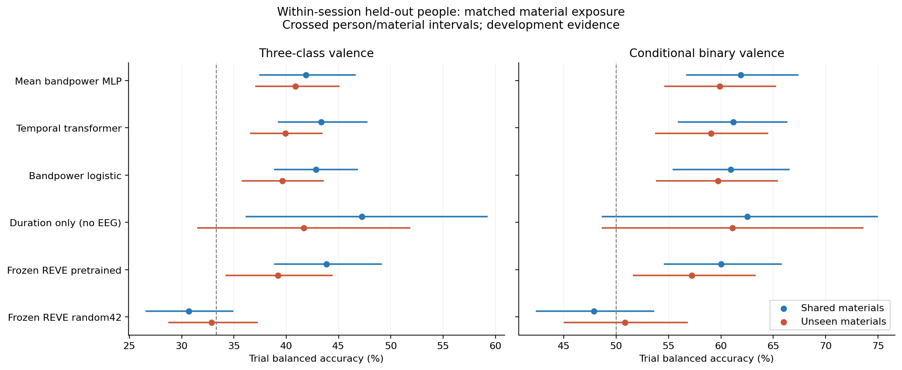
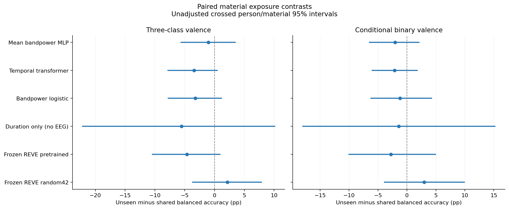

# Matched within-session material findings — 6 October 2026

**Completed and verified:** 540 neural fits, 360 selected linear heads, all 1,440 independently refitted linear candidates and 21,600 test probability rows. The primary question here is whether performance changes when test stimulus materials are absent from training, while holding participant groups, session, training size and test trials fixed. This is SEED-IV development evidence. **The manuscript and research question remain unchanged; no pivot is approved.**

**Research assessment:** all 12 of 12 material-exposure contrast intervals include zero when both people and materials are resampled. The transformer falls from 43.35% to 39.92%, difference -3.44 pp, crossed interval [-7.88, +0.56]. These data allow a meaningful drop as well as a small or absent average effect; they do not establish equivalence. They do not support adopting a strong material-generalization or negative-transfer contribution yet.

On unseen materials, transformer-minus-MLP is -0.95 pp with crossed interval [-4.26, +2.41]. Frozen pretrained-minus-random REVE is +6.36 pp with crossed interval [-0.13, +12.90]; its unseen-material advantage is uncertain under this analysis, despite a positive point estimate. The current controls establish no clear new model advantage.

## Identical comparison population

The [protocol](Within_Session_Material_Control_Protocol_2026-10-06.md) and [plan](../../results/development/within_session_material_seediv/plan.json) were saved and pushed before fitting. Use all 1,080 original trials from 15 people, three sessions and 72 design-supported material keys. Each fit uses one session and disjoint nine/three/three training/validation/test people. Both arms have **108 training, 12 validation and 24 identical test trials**, with equal native-emotion counts and training people. Test clips are present among other training people in the shared-material arm, and excluded from training and selection in the unseen-material arm. Validation clips are disjoint from both training and test clips in both arms.

Within every session/native-emotion stratum, six clips receive a fixed random rank before fitting. Three rotations test every clip once; five participant rotations test every person once. Four training clips are common to the arms and eight are replaced. No test person's data enter fitting, normalization or selection across any session. Source-only feature scalers are refitted for every condition.

Neural models retain the previously declared 19,079-parameter mean MLP and 19,075-parameter temporal transformer. Each receives 600 balanced 60-trial updates, with identical participant/emotion/rank draw streams and initial weights in paired arms. Three initialization seeds are averaged, not counted as additional participants. Checkpoints are chosen from validation every 25 updates using three-class BA then balanced log loss. No augmentation, scheduler, target-population calibration or test-based choice occurs.

## All model results

| Model | Shared test materials: 3-class BA | Unseen test materials: 3-class BA | Shared: binary BA | Unseen: binary BA |
|---|---:|---:|---:|---:|
| Mean bandpower MLP | 41.89% | 40.86% | 61.91% | 59.88% |
| Temporal transformer | 43.35% | 39.92% | 61.17% | 59.04% |
| Bandpower logistic | 42.84% | 39.63% | 60.93% | 59.72% |
| Duration only (no EEG) | 47.22% | 41.67% | 62.50% | 61.11% |
| Frozen REVE pretrained | 43.83% | 39.20% | 60.00% | 57.22% |
| Frozen REVE random42 | 30.68% | 32.84% | 47.87% | 50.83% |

Primary targets are neutral / negative (sadness and fear) / positive (happiness), with 33.33% chance BA. Conditional binary excludes the same 270 neutral trials, leaving 810 observations; chance BA is 50%. Binary probabilities retain the defined neutral-mass floor and negative tie rule. Targets are stimulus-assigned classes, not individual self-reported valence.

The bandpower logistic control uses the same first-ten four-second frames, averaged per trial. The duration control uses full original trial length with **no EEG** and is a diagnostic, not an eligible EEG superiority baseline. The frozen pretrained and random42 REVE features reuse the [verified encoder audit and adapter](GRU-XNet_Session_Pretraining_Findings_2026-10-06.md); no encoder is updated. These heads use the same source-only participant/material splits, four C candidates and validation selection. Only one random encoder initialization is tested.

## All paired contrasts and uncertainty

Resample 15 people and independently six materials within each of twelve session/native-emotion strata using 10,000 fixed paired draws. Average neural-seed correctness within each person/material cell. Participant-only draws hold clips fixed; crossed draws also vary observed material keys. Folds, fitted models, three observed sessions and the split assignments remain fixed. Percentile intervals are exploratory and unadjusted across 20 contrasts.

| Paired contrast (A minus B) | Target | Difference (pp) | Person-only 95% interval | Person/material 95% interval |
|---|---|---:|---:|---:|
| Mean bandpower MLP: unseen minus shared | coarse3 | -1.03 | [-3.52, +1.48] | [-5.70, +3.56] |
| Temporal transformer: unseen minus shared | coarse3 | -3.44 | [-5.06, -1.77] | [-7.88, +0.56] |
| Bandpower logistic: unseen minus shared | coarse3 | -3.21 | [-5.49, -1.05] | [-7.84, +1.23] |
| Duration only (no EEG): unseen minus shared | coarse3 | -5.56 | [-5.56, -5.56] | [-22.22, +10.19] |
| Frozen REVE pretrained: unseen minus shared | coarse3 | -4.63 | [-7.65, -1.67] | [-10.49, +0.99] |
| Frozen REVE random42: unseen minus shared | coarse3 | +2.16 | [-0.74, +4.88] | [-3.77, +7.96] |
| Temporal transformer minus Mean bandpower MLP (exposed) | coarse3 | +1.46 | [-0.37, +3.29] | [-2.02, +5.06] |
| Frozen REVE pretrained minus Frozen REVE random42 (exposed) | coarse3 | +13.15 | [+8.77, +17.90] | [+6.67, +19.63] |
| Temporal transformer minus Mean bandpower MLP (unexposed) | coarse3 | -0.95 | [-2.59, +0.72] | [-4.26, +2.41] |
| Frozen REVE pretrained minus Frozen REVE random42 (unexposed) | coarse3 | +6.36 | [+2.34, +11.17] | [-0.13, +12.90] |
| Mean bandpower MLP: unseen minus shared | binary | -2.04 | [-4.04, -0.15] | [-6.54, +2.16] |
| Temporal transformer: unseen minus shared | binary | -2.13 | [-4.23, -0.15] | [-6.08, +1.88] |
| Bandpower logistic: unseen minus shared | binary | -1.20 | [-3.52, +1.11] | [-6.30, +4.35] |
| Duration only (no EEG): unseen minus shared | binary | -1.39 | [-1.39, -1.39] | [-18.06, +15.28] |
| Frozen REVE pretrained: unseen minus shared | binary | -2.78 | [-6.39, +1.02] | [-10.09, +5.00] |
| Frozen REVE random42: unseen minus shared | binary | +2.96 | [-0.37, +6.48] | [-3.98, +10.00] |
| Temporal transformer minus Mean bandpower MLP (exposed) | binary | -0.74 | [-2.13, +0.62] | [-3.46, +2.01] |
| Frozen REVE pretrained minus Frozen REVE random42 (exposed) | binary | +12.13 | [+8.24, +15.93] | [+5.09, +19.07] |
| Temporal transformer minus Mean bandpower MLP (unexposed) | binary | -0.83 | [-2.47, +0.86] | [-4.26, +2.81] |
| Frozen REVE pretrained minus Frozen REVE random42 (unexposed) | binary | +6.39 | [+2.87, +10.00] | [-0.74, +13.70] |

All seed metrics and all nine session/material-rotation cells are retained in [all_seeds.csv](../../results/development/within_session_material_seediv/all_seeds.csv) and [all_cells.csv](../../results/development/within_session_material_seediv/all_cells.csv); full metrics and both uncertainty analyses are in [comparison.json](../../results/development/within_session_material_seediv/comparison.json). Never choose a preferred seed or cell from its test score.

## Selection noise and hardware

Each validation set has only twelve trials: three neutral, six negative and three positive. This makes model selection noisy. The full 600-update budget is retained even when an early checkpoint is selected. The following means describe selected per-fit train/validation/test scores; primary headline scores above aggregate original out-of-fold trials and average seeds.

| Neural model | Arm | Median selected update | Mean train BA | Mean validation BA | Mean test BA |
|---|---|---:|---:|---:|---:|
| Mean bandpower MLP | exposed | 100 | 88.81% | 48.60% | 41.89% |
| Mean bandpower MLP | unexposed | 125 | 90.73% | 49.96% | 40.86% |
| Temporal transformer | exposed | 75 | 83.20% | 51.48% | 43.35% |
| Temporal transformer | unexposed | 100 | 83.17% | 50.08% | 39.92% |

The [540-fit diagnostic table](../../results/development/within_session_material_seediv/training_diagnostics.csv) records every selected update, split metric, time and allocation. Fits total **2916.3 seconds**, with peak **70.45 MiB allocated CUDA tensors**, on the RTX 3050 using the existing PyTorch environment. Tensor memory excludes CUDA context, display/driver allocations and other processes. Frozen extraction occurred in the earlier phase and is not included in this fit-time measure.

## Verification, scope and research decision

The [verification record](../../results/development/within_session_material_seediv/verification.json) binds source hashes, input/cache metadata, material assignments and participant folds. It independently replays all 540 selected neural checkpoints and their train/validation/test metrics, training-only scalers, paired batch signatures, initial states and validation selection. Maximum neural probability replay error is 2.98e-08. It refits all 1,440 linear candidates, reproduces all 360 selected coefficients, checks every prediction row, exact once-per-trial coverage and recomputes the complete paired bootstrap. The scientific-control suite has 47 passing tests. Downloaded author code, weights, waveforms, embeddings and checkpoints remain local; bounded derived evidence is exported.

This comparison reduces the preceding recording-session confound by keeping both arms inside the same session index with the same people and test observations. It still changes training clip content, difficulty, chronological position and duration. It does **not** isolate a causal video-identity mechanism. Original media hashes are unavailable, so session/trial position is a published-design material proxy. This cohort has already been inspected in earlier development work. The REVE open-subset corpus documentation does not independently certify exclusion of all target recordings from the complete pretrained checkpoint.

Earlier session-control fits used 216 training and 72 validation trials; this experiment uses 108 and 12. Cross-phase score changes cannot be attributed only to material generalization. Within-phase pairs have equal access and size. These results do not test one jointly selected three-corpus model, unseen-corpus transfer or a new mitigation method.

The [focused prior-work audit](GRU-XNet_Material_Generalization_Research_Update_2026-10-06.md) records the EMBC 2021 subject/material precedent and recent stimulus-aware, data-centric and brain-region-transformer work. Holding out materials or adding a transformer alone is not an established novel contribution. Use the entire result to decide whether further robustness experiments are warranted; do not adopt a paper pivot automatically.

The earlier transformer session-transfer difference was -5.74 pp with crossed interval [-9.51,-2.21]. The present within-session estimate is smaller and less precise, but training/validation size and material access also differ between phases. It would be incorrect to infer that recording-day shift alone caused the earlier drop. Repeat independent material/participant groupings and extend a compatible binary control to DEAP before deciding whether a systematic robustness contribution is supported. The metadata audit identifies GAMEEMO's sparse game-condition and class coverage constraints; that extension needs a different explicitly declared protocol. No further grouping or corpus experiment is represented as completed here.

The [readiness checklist](GRU-XNet_Publication_Readiness_2026-10-05.md) still tracks unfinished matched full GRU-XNet ablations, broader repeated subject/LODO comparisons, first-party DEAP authentication, historical provenance, novelty assessment and a revised compilable paper. The manuscript remains [archived](../paper_archive/2026-10-05-pre-exploration/README.md). Show a concrete proposed research question with evidence, obtain author approval, and archive the then-current paper immediately before adopting any change.
